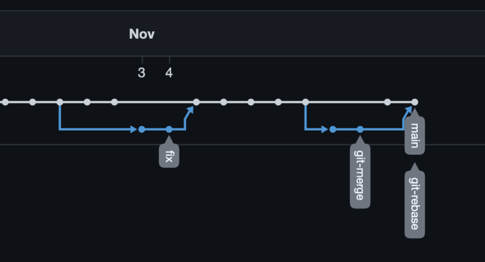

# Практическое задание по теме «Ветвления в Git»

Граф [Network](https://github.com/malyushkin/netology-dvpspdc-2/network) по итогам выполнения домашнего задания:

В ходе выполнения работы получены практические навыки работы с командами `git merge` (слияние) и `git rebase` (перебазирование).