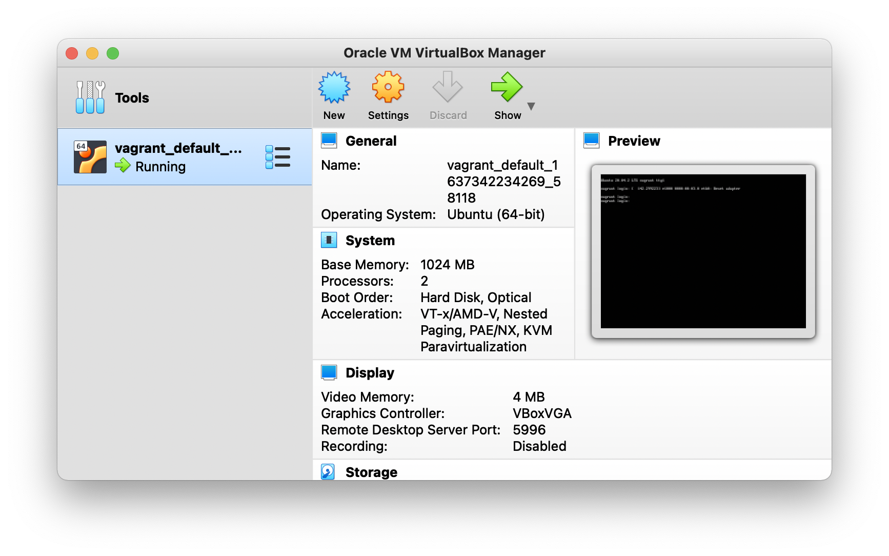
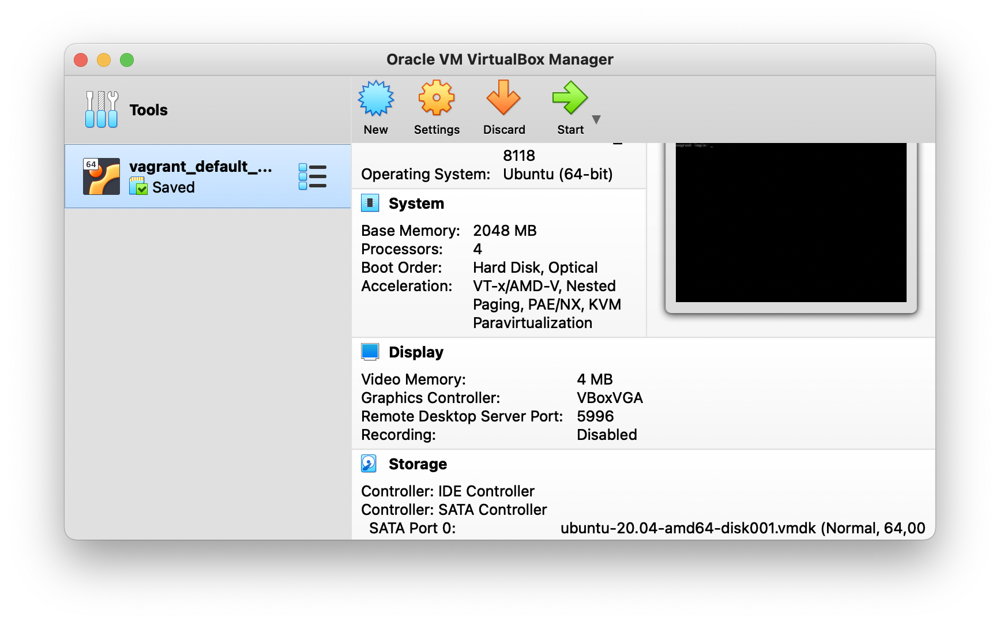

# Практическое задание по теме «Работа в терминале 1»

1. Скачал и установил VirtualBox 6.1.28 (по [ссылке](https://download.virtualbox.org/virtualbox/6.1.28/VirtualBox-6.1.28-147628-OSX.dmg))
2. Скачал и установил Vagrant 2.2.19 (по [ссылке](https://releases.hashicorp.com/vagrant/2.2.19/vagrant_2.2.19_x86_64.dmg))
3. Создал папку `vagrant` командой `mkdir vagrant` 
4. Далее, изменил содержимое `Vagrantfile` на то, что представлено в задании и запустил `vagrant up`

В первый раз не вышло, ошибка:

```bash
==> default: Booting VM...
There was an error while executing `VBoxManage`, a CLI used by Vagrant
for controlling VirtualBox. The command and stderr is shown below.

Command: ["startvm", "d5b0d67b-08b9-476a-80f1-358836c1f092", "--type", "headless"]

Stderr: VBoxManage: error: The virtual machine 'vagrant_default_1637342234269_58118' has terminated unexpectedly during startup with exit code 1 (0x1)
VBoxManage: error: Details: code NS_ERROR_FAILURE (0x80004005), component MachineWrap, interface IMachine
```

Так как после установки ПО я не перезагружал устройство, перезагрузил сейчас. После этого снова запустил `vagrant up` и команда успешно отработала:

```bash
...
==> default: Machine booted and ready!
==> default: Checking for guest additions in VM...
==> default: Mounting shared folders...
    default: /vagrant => /Users/romanmaliushkin/Documents/Courses/Netology/netology-dvpspdc-2/03-sysadmin-01-terminal/vagrant
```

Выполнил `vagrant suspend`.

5. Командой `vagrant ssh` запустил SSH-сессию в развёрнутом Ubuntu. 

# Ответы 

5. Ознакомьтесь с графическим интерфейсом VirtualBox, посмотрите как выглядит виртуальная машина, которую создал для вас Vagrant, какие аппаратные ресурсы ей выделены. Какие ресурсы выделены по-умолчанию?



Согласно интерфейсу VirtualBox, выделены следующие ресурсы:

**Система**
* Base memory: 1024 MB
* Processors: 2
* ... 

**Дисплей**
* Video memory: 4 MB
* Graphics Controller: VBoxVGA
* ...

6. Ознакомьтесь с возможностями конфигурации VirtualBox через Vagrantfile: документация. Как добавить оперативной памяти или ресурсов процессора виртуальной машине?

Для изменения конфигруации необходимо добавить блок `config.vm.provider`:

```bash 
config.vm.provider "virtualbox" do |v|
    v.memory = 2048
    v.cpus = 4
end
```

Затем выключить `vagrant halt` и перезапустить Vagrant `vagrant up`.



Ресурсы изменились.

8. Ознакомиться с разделами `man bash`, почитать о настройках самого bash:

* какой переменной можно задать длину журнала `history`, и на какой строчке manual это описывается?

  1. Посмотрим на каких строках упоминается команда `history` командой `man bash | grep -n history`
  2. После этого командой `man bash | sed -n 'X,+Yp'` посмотрим упоминания команды и найдём переменную задающую длину журнала. Командой `cat -n` выведем номера строк

```bash
man bash | grep -n history
```

```bash
...
624:              quent lines of a multi-line compound command are not tested, and are added to the history regardless of the value of HISTCONTROL.
626:              The name of the file in which command history is saved (see HISTORY below).  The default value is ~/.bash_history.  If unset, the command history is not saved when a shell exits.
628:              The  maximum number of lines contained in the history file.  When this variable is assigned a value, the history file is truncated, if necessary, to contain no more than that number of
...
```

```bash
man bash | cat -n | sed -n '620,+20p'
```

```bash
...
627	       HISTFILESIZE
628	              The  maximum number of lines contained in the history file.  When this variable is assigned a value, the history file is truncated, if necessary, to contain no more than that number of
...
```

Переменная `HISTFILESIZE` задаёт длину журнала `history`, описывается на 627-628 строках.

* что делает директива `ignoreboth` в bash?

```bash
man bash | grep -B 2 -A 3 ignoreboth
```

```bash
HISTCONTROL
        A  colon-separated  list of values controlling how commands are saved on the history list.  If the list of values includes ignorespace, lines which begin with a space character are not
        saved in the history list.  A value of ignoredups causes lines matching the previous history entry to not be saved.  A value of ignoreboth is shorthand for ignorespace and  ignoredups.
        A value of erasedups causes all previous lines matching the current line to be removed from the history list before that line is saved.  Any value not in the above list is ignored.  If
        HISTCONTROL is unset, or does not include a valid value, all lines read by the shell parser are saved on the history list, subject to the value of HISTIGNORE.  The  second  and  subse‐
        quent lines of a multi-line compound command are not tested, and are added to the history regardless of the value of HISTCONTROL.         
```

Директива `ignoreboth` является сокращением для `ignorespace` и `ignoredups`. `ignorespace` — игнорирование строк, начинающихся с пробела. `ignoredups` — игнорирование строк-дубликатов предыдущих.

9. В каких сценариях использования применимы скобки `{}` и на какой строчке `man bash` это описано?

```bash
man bash | grep -n {
```

Фигурные скобки `{}` используются для вызова списка в командах. Например, создать папки с названиями 1, 2, ..., 10: `mkdir folder_{1..10}`. Описание на 206 строке.

10. С учётом ответа на предыдущий вопрос, как создать однократным вызовом `touch` 100000 файлов? Получится ли аналогичным образом создать 300000? Если нет, то почему?

```bash
touch {1..100000}
```

100000 файлов создалось. 300000 нет, получил ошибку: `Argument list too long`. Существует ограничение на максимальное количество аргументов в команде. 

```bash
getconf ARG_MAX
```

```bash
2097152
```

11. В man bash поищите по `/\[\[`. Что делает конструкция `[[ -d /tmp ]]`?

```bash
man bash | grep "\[\["
```

Конструкция `[[ -d /tmp ]]` возвращает 1, если выражение в скобках верное, 0 — если не верное.

```bash
[[ -d /tmp ]] && echo True
```

```bash
True
```

12. Основываясь на знаниях о просмотре текущих (например, PATH) и установке новых переменных; командах, которые мы рассматривали, добейтесь в выводе `type -a bash` в виртуальной машине наличия первым пунктом в списке:

	```bash
	bash is /tmp/new_path_directory/bash
	bash is /usr/local/bin/bash
	bash is /bin/bash
	```

	(прочие строки могут отличаться содержимым и порядком)
    В качестве ответа приведите команды, которые позволили вам добиться указанного вывода или соответствующие скриншоты.

```bash
mkdir /tmp/new_path_directory
cp /bin/bash /tmp/new_path_directory/bash
export PATH="/tmp/new_path_directory:$PATH"  

type -a bash
```

```bash
bash is /tmp/new_path_directory/bash
bash is /usr/bin/bash
bash is /bin/bash
```

13. Чем отличается планирование команд с помощью `batch` и `at`?

`at` запускает команду в назначенное время.

`batch` запускает команду при достижении определённого уровня нагрузки системы.