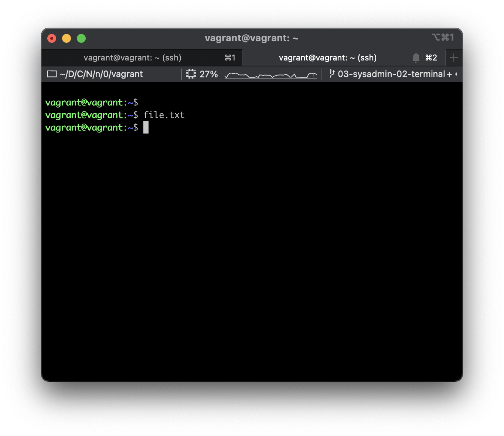

# Ответы

1. Какого типа команда `cd`? Попробуйте объяснить, почему она именно такого типа; опишите ход своих мыслей, если считаете что она могла бы быть другого типа.

```bash
type cd

cd is a shell builtin
```

```bash
whereis cd

cd:
```

Команда `cd` (change directory) встроенная команда shell для изменения текущей директории. Не является файлом/процессом. Таким образом есть тип встроенных (builtin) команд, среди которых `cd`.

2. Какая альтернатива без pipe команде `grep <some_string> <some_file> | wc -l`? `man grep` поможет в ответе на этот вопрос. Ознакомьтесь с [документом](http://www.smallo.ruhr.de/award.html) о других подобных некорректных вариантах использования pipe.

Альтернатива: `grep -c <some_string> <some_file>`. Флаг `-c` выводит количество строк в которых найдено совпадение строки.

3. Какой процесс с PID `1` является родителем для всех процессов в вашей виртуальной машине Ubuntu 20.04?

```bash
pstree -p 1
```

```bash
systemd(1)─┬─VBoxService(808)─┬─{VBoxService}(810)
           │                  ├─{VBoxService}(811)
           │                  ├─{VBoxService}(812)
           │                  ├─{VBoxService}(813)
           │                  ├─{VBoxService}(814)
           │                  ├─{VBoxService}(815)
           │                  ├─{VBoxService}(816)
           │                  └─{VBoxService}(817)
           ├─accounts-daemon(606)─┬─{accounts-daemon}(627)
           │                      └─{accounts-daemon}(659)
           ├─agetty(845)
           ├─atd(834)
           ├─cron(831)
           ├─dbus-daemon(607)
           ├─irqbalance(625)───{irqbalance}(641)
           ├─multipathd(557)─┬─{multipathd}(558)
           │                 ├─{multipathd}(559)
           │                 ├─{multipathd}(560)
           │                 ├─{multipathd}(561)
           │                 ├─{multipathd}(562)
           │                 └─{multipathd}(563)
           ├─networkd-dispat(628)
           ├─polkitd(671)─┬─{polkitd}(672)
           │              └─{polkitd}(674)
           ├─rpcbind(584)
           ├─rsyslogd(634)─┬─{rsyslogd}(649)
           │               ├─{rsyslogd}(650)
           │               └─{rsyslogd}(651)
           ├─sshd(837)───sshd(4465)───sshd(4519)───bash(4520)─┬─nano(4558)
           │                                                  └─pstree(4612)
           ├─systemd(4480)───(sd-pam)(4481)
           ├─systemd-journal(384)
           ├─systemd-logind(643)
           ├─systemd-network(418)
           ├─systemd-resolve(585)
```

Процесс `systemd`.

4. Как будет выглядеть команда, которая перенаправит вывод stderr `ls` на другую сессию терминала?

Чтобы выяснить путь текущего терминала введём команду `tty`:

```bash
tty
```

```bash
/dev/pts/0
```

Для другой сессии используем путь `/dev/pts/1`:

```bash
ls 2>/dev/pts/1
```

Для проверки создал ещё одну SSH-сессию `ssh vagrant` и направил поток std out по пути `/dev/pts/1`: `ls 2>/dev/pts/1`:



5. Получится ли одновременно передать команде файл на stdin и вывести ее stdout в другой файл? Приведите работающий пример.

```bash
cat < file.txt > file_2.txt
```

6. Получится ли находясь в графическом режиме, вывести данные из PTY в какой-либо из эмуляторов TTY? Сможете ли вы наблюдать выводимые данные?

Да, получится. Пример приводил в задании 4. Другой пример: `echo 'Hello World!' > /dev/pts/1`.

7. Выполните команду `bash 5>&1`. К чему она приведет? Что будет, если вы выполните `echo netology > /proc/$$/fd/5`? Почему так происходит? 

Команда `bash 5>&1` создаёт дескриптор с условным номером 5 и связывает его с std out текущего процесса. При выполнении команды `echo netology > /proc/$$/fd/5` выведится слово `netology`.

8. Получится ли в качестве входного потока для pipe использовать только stderr команды, не потеряв при этом отображение stdout на pty? Напоминаем: по умолчанию через pipe передается только stdout команды слева от `|` на stdin команды справа.
Это можно сделать, поменяв стандартные потоки местами через промежуточный новый дескриптор, который вы научились создавать в предыдущем вопросе.

Направляем созданный 5 дескриптор на 2, а 2 на 1: `ls dir 5>&2 2>&1 | grep dir`.

9. Что выведет команда `cat /proc/$$/environ`? Как еще можно получить аналогичный по содержанию вывод?

Команда выводит переменные окружения текущей сессии. Аналог — `env`.

10. Используя `man`, опишите что доступно по адресам `/proc/<PID>/cmdline`, `/proc/<PID>/exe`.

```bash
man proc | grep -n -B 1 -A 2 cmdline
man proc | grep -n -B 1 -A 2 exe
```

`/proc/<PID>/cmdline` — файл, содержащий полную командную строку для процесса.

`/proc/<PID>/exe` — файл, содержащий символьную ссылку на фактический путь к процессу

11. Узнайте, какую наиболее старшую версию набора инструкций SSE поддерживает ваш процессор с помощью `/proc/cpuinfo`.

```bash
cat /proc/cpuinfo | grep sse
```

Версия SSE: `sse4_2`.

12. При открытии нового окна терминала и `vagrant ssh` создается новая сессия и выделяется pty. Это можно подтвердить командой `tty`, которая упоминалась в лекции 3.2. Однако:

     ```bash
     vagrant@netology1:~$ ssh localhost 'tty'
     not a tty
     ```

     Почитайте, почему так происходит, и как изменить поведение.

Необходимо принудительно выделить rty с помощью флага `-t`:

```bash
ssh -t localhost 'tty'
```

13. Бывает, что есть необходимость переместить запущенный процесс из одной сессии в другую. Попробуйте сделать это, воспользовавшись `reptyr`. Например, так можно перенести в `screen` процесс, который вы запустили по ошибке в обычной SSH-сессии.

Для имитации тяжелого процесса создам 100000 файлов `touch {1..100000}`, затем прерву исполнение командой `Cmd + Z`. После чего зафиксирую количество созданных файлов. Так же зафиксирую PID нужного мне процесса. Перейду в новую сессию и выполню эту же команду с `reptyr`. 

```bash
touch {1..100000}

ls | wc -l
```

```bash
12802
````

```bash
ps -a | grep touch
```

```bash
   5719 pts/0    00:00:00 touch
```

```bash 
screen
touch {1..100000} reptyr 5719
exit
```

```bash
ls | wc -l
```

```bash
100001
```

100001-й файл — это файл `reptyr`.

14. `sudo echo string > /root/new_file` не даст выполнить перенаправление под обычным пользователем, так как перенаправлением занимается процесс shell'а, который запущен без `sudo` под вашим пользователем. Для решения данной проблемы можно использовать конструкцию `echo string | sudo tee /root/new_file`. Узнайте что делает команда `tee` и почему в отличие от `sudo echo` команда с `sudo tee` будет работать.

Команда `tee` используется для записи вывода в файл и обладает правами для записи в `root`.