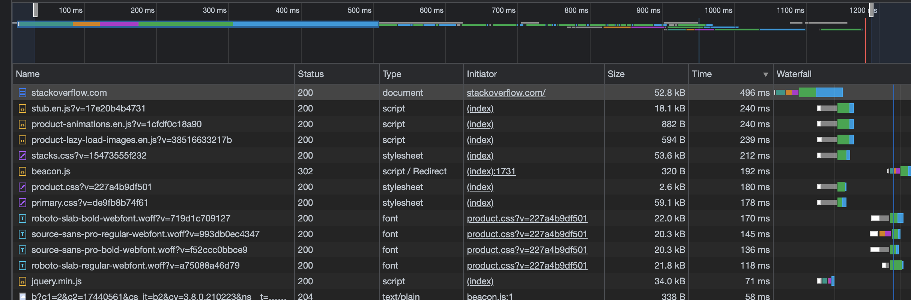

# Ответы

1. Работа c HTTP через телнет.
- Подключитесь утилитой телнет к сайту stackoverflow.com
`telnet stackoverflow.com 80`
- отправьте HTTP запрос
```bash
GET /questions HTTP/1.0
HOST: stackoverflow.com
[press enter]
[press enter]
```
- В ответе укажите полученный HTTP код, что он означает?

```http request
HTTP/1.1 301 Moved Permanently
cache-control: no-cache, no-store, must-revalidate
location: https://stackoverflow.com/questions
x-request-guid: 80014493-fd11-41fe-be26-fde1e4601edd
feature-policy: microphone 'none'; speaker 'none'
content-security-policy: upgrade-insecure-requests; frame-ancestors 'self' https://stackexchange.com
Accept-Ranges: bytes
Date: Fri, 10 Dec 2021 21:07:28 GMT
Via: 1.1 varnish
Connection: close
X-Served-By: cache-hhn4059-HHN
X-Cache: MISS
X-Cache-Hits: 0
X-Timer: S1639170449.551984,VS0,VE170
Vary: Fastly-SSL
X-DNS-Prefetch-Control: off
Set-Cookie: prov=a24d43df-f5ec-8260-79b7-bbcd08eae1a5; domain=.stackoverflow.com; expires=Fri, 01-Jan-2055 00:00:00 GMT; path=/; HttpOnly

Connection closed by foreign host.
```

Код ответа 301 (Moved Permanently) означает что страница перемещена на новый адрес, а старый (те текущий) следует считать устаревшим.  Новый адрес: https://stackoverflow.com/questions.

---

2. Повторите задание 1 в браузере, используя консоль разработчика F12.
- откройте вкладку `Network`
- отправьте запрос http://stackoverflow.com
- найдите первый ответ HTTP сервера, откройте вкладку `Headers`
- укажите в ответе полученный HTTP код.
- проверьте время загрузки страницы, какой запрос обрабатывался дольше всего?
- приложите скриншот консоли браузера в ответ.

HTTP-код первого ответа:

```http request
Request URL: http://stackoverflow.com/
Request Method: GET
Status Code: 307 Internal Redirect
Referrer Policy: strict-origin-when-cross-origin
```

Наиболее продолжительные запросы: 



Самым долгим можно назвать: https://cdn.sstatic.net/Js/stub.en.js?v=17e20b4b4731

---

3. Какой IP адрес у вас в интернете?

```bash
roman@MacBook-Pro-admin % curl ifconfig.me

188.243.84.7*%                            
```

---

4. Какому провайдеру принадлежит ваш IP адрес? Какой автономной системе AS? Воспользуйтесь утилитой `whois`

```bash 
roman@MacBook-Pro-admin % whois 188.243.84.*

...
route:          188.243.64.*
descr:          SkyNet Networks
origin:         AS35807
mnt-by:         MNT-SKNT
...
```

---

5. Через какие сети проходит пакет, отправленный с вашего компьютера на адрес 8.8.8.8? Через какие AS? Воспользуйтесь утилитой `traceroute`

```bash
roman@MacBook-Pro-admin % traceroute -an 8.8.8.8

traceroute to 8.8.8.8 (8.8.8.8), 64 hops max, 52 byte packets
 1  [AS0] 192.168.1.1  3.338 ms  2.515 ms  1.573 ms
 2  * * *
 3  [AS35807] 93.100.0.66  4.751 ms  3.938 ms  7.068 ms
 4  [AS35807] 93.100.0.46  2.627 ms  3.332 ms  3.096 ms
 5  [AS35807] 185.37.128.161  2.846 ms  2.721 ms  3.412 ms
 6  [AS15169] 72.14.216.110  5.059 ms  3.655 ms  3.195 ms
 7  * * *
 8  [AS15169] 209.85.240.254  9.408 ms
    [AS15169] 209.85.252.220  3.420 ms
    [AS15169] 74.125.244.129  4.590 ms
 9  [AS15169] 74.125.244.133  4.426 ms  3.898 ms
    [AS15169] 74.125.244.180  7.289 ms
10  [AS15169] 216.239.48.163  34.238 ms  7.299 ms
    [AS15169] 72.14.232.84  11.062 ms
11  [AS15169] 172.253.51.189  9.119 ms
    [AS15169] 108.170.233.163  6.765 ms
    [AS15169] 216.239.40.61  8.531 ms
12  [AS15169] 142.250.208.23  13.287 ms *
    [AS15169] 216.239.63.27  15.897 ms
...
```

---

6. Повторите задание 5 в утилите `mtr`. На каком участке наибольшая задержка - delay?

```bash
                                                  My traceroute  [v0.93]
vagrant (10.0.2.15)                                                                               2021-12-10T21:55:00+0000
Keys:  Help   Display mode   Restart statistics   Order of fields   quit
                                                                                  Packets               Pings
 Host                                                                           Loss%   Snt   Last   Avg  Best  Wrst StDev
 1. _gateway                                                                     0.0%    50    0.4   0.9   0.2  21.6   3.1
 2. 192.168.1.1                                                                  2.0%    50    4.2   4.2   1.9  55.0   7.6
 3. (waiting for reply)
 4. router.sknt.ru                                                               0.0%    50    3.0   4.8   2.3  19.1   3.5
 5. k12-core                                                                     0.0%    50    8.1   4.9   2.5  29.1   4.3
 6. SEL-CORE                                                                     2.0%    50    3.1   4.3   2.4  22.8   3.3
 7. 72.14.216.110                                                                0.0%    50    2.9   5.3   2.9  36.2   5.4
 8. 172.253.76.91                                                                0.0%    50    3.3   4.3   2.7  18.6   2.8
 9. 74.125.244.181                                                               0.0%    50   22.9   6.4   2.9  30.3   5.6
10. 72.14.232.84                                                                 0.0%    49    4.8  12.4   3.2 158.2  27.6
11. 142.251.61.219                                                               0.0%    49    7.5   9.5   6.9  35.3   4.6
12. 216.239.63.27                                                                0.0%    49    9.2  11.5   7.5  68.6   9.0
13. (waiting for reply)
14. (waiting for reply)
15. (waiting for reply)
16. (waiting for reply)
17. (waiting for reply)
18. (waiting for reply)
19. (waiting for reply)
20. (waiting for reply)
21. (waiting for reply)
22. dns.google                                                                  14.3%    49    6.9   8.6   6.3  17.7   2.7
```

Наибольшая задержка: 74.125.244.181

---

7. Какие DNS сервера отвечают за доменное имя dns.google? Какие A записи? воспользуйтесь утилитой `dig`

```bash
roman@MacBook-Pro-admin % dig -t ns dns.google

; <<>> DiG 9.10.6 <<>> -t ns dns.google
;; global options: +cmd
;; Got answer:
;; ->>HEADER<<- opcode: QUERY, status: NOERROR, id: 46902
;; flags: qr rd ra; QUERY: 1, ANSWER: 4, AUTHORITY: 0, ADDITIONAL: 9

;; OPT PSEUDOSECTION:
; EDNS: version: 0, flags:; udp: 4000
;; QUESTION SECTION:
;dns.google.			IN	NS

;; ANSWER SECTION:
dns.google.		86400	IN	NS	ns2.zdns.google.
dns.google.		86400	IN	NS	ns4.zdns.google.
dns.google.		86400	IN	NS	ns1.zdns.google.
dns.google.		86400	IN	NS	ns3.zdns.google.

;; ADDITIONAL SECTION:
ns2.zdns.google.	23518	IN	A	216.239.34.114
ns2.zdns.google.	38215	IN	AAAA	2001:4860:4802:34::72
ns4.zdns.google.	3600	IN	A	216.239.38.114
ns4.zdns.google.	3600	IN	AAAA	2001:4860:4802:38::72
ns1.zdns.google.	67549	IN	A	216.239.32.114
ns1.zdns.google.	3600	IN	AAAA	2001:4860:4802:32::72
ns3.zdns.google.	3600	IN	A	216.239.36.114
ns3.zdns.google.	3600	IN	AAAA	2001:4860:4802:36::72

;; Query time: 97 msec
;; SERVER: 192.168.39.103#53(192.168.39.103)
;; WHEN: Sat Dec 11 01:06:38 MSK 2021
;; MSG SIZE  rcvd: 292
```

DNS сервера:

* ns2.zdns.google.
* ns4.zdns.google.
* ns1.zdns.google.
* ns3.zdns.google.

```bash
roman@MacBook-Pro-admin % dig dns.google 

; <<>> DiG 9.10.6 <<>> dns.google
;; global options: +cmd
;; Got answer:
;; ->>HEADER<<- opcode: QUERY, status: NOERROR, id: 55837
;; flags: qr rd ra; QUERY: 1, ANSWER: 2, AUTHORITY: 0, ADDITIONAL: 1

;; OPT PSEUDOSECTION:
; EDNS: version: 0, flags:; udp: 4000
;; QUESTION SECTION:
;dns.google.			IN	A

;; ANSWER SECTION:
dns.google.		529	IN	A	8.8.4.4
dns.google.		529	IN	A	8.8.8.8

;; Query time: 48 msec
;; SERVER: 192.168.39.103#53(192.168.39.103)
;; WHEN: Sat Dec 11 01:08:40 MSK 2021
;; MSG SIZE  rcvd: 71

```

A-записи:

* 8.8.4.4
* 8.8.8.8

---

8. Проверьте PTR записи для IP адресов из задания 7. Какое доменное имя привязано к IP? воспользуйтесь утилитой `dig`

```bash
roman@MacBook-Pro-admin % dig -x 216.239.34.114 +short
ns2.zdns.google.
```

---

Все задания, за исключением 6, были выполнены на локальной машине (macOS).