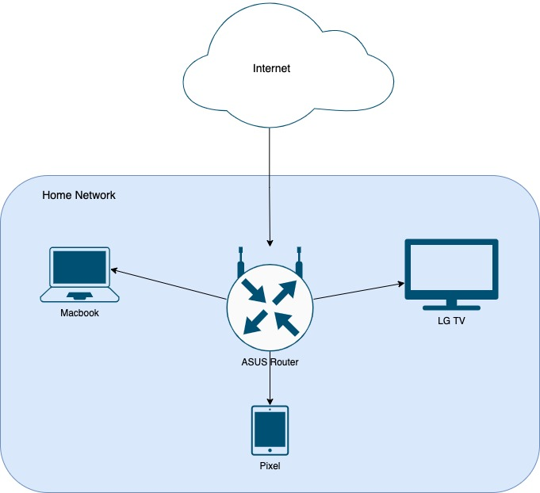

# Практическое задание по теме «Компьютерные сети 3»

1. Подключитесь к публичному маршрутизатору в интернет. Найдите маршрут к вашему публичному IP
```
telnet route-views.routeviews.org
Username: rviews
show ip route x.x.x.x/32
show bgp x.x.x.x/32
```

```bash
route-views>show ip route 188.243.84.76

Routing entry for 188.242.0.0/15, supernet
  Known via "bgp 6447", distance 20, metric 0
  Tag 6939, type external
  Last update from 64.71.137.241 7w0d ago
  Routing Descriptor Blocks:
  * 64.71.137.241, from 64.71.137.241, 7w0d ago
      Route metric is 0, traffic share count is 1
      AS Hops 2
      Route tag 6939
      MPLS label: none
      
route-views>show bgp 188.243.84.76

BGP routing table entry for 188.242.0.0/15, version 65720010
Paths: (23 available, best #22, table default)
  Not advertised to any peer
  Refresh Epoch 3
  3303 6939 35807
    217.192.89.50 from 217.192.89.50 (138.187.128.158)
      Origin IGP, localpref 100, valid, external, atomic-aggregate
      Community: 3303:1006 3303:1021 3303:1030 3303:3067 6939:7040 6939:8752 6939:9002
      path 7FE11A6181D8 RPKI State not found
      rx pathid: 0, tx pathid: 0
  Refresh Epoch 1
  4901 6079 9002 35807
    162.250.137.254 from 162.250.137.254 (162.250.137.254)
      Origin IGP, localpref 100, valid, external, atomic-aggregate
      Community: 65000:10100 65000:10300 65000:10400
      path 7FE0AD7B1760 RPKI State not found
      rx pathid: 0, tx pathid: 0
  Refresh Epoch 1
  57866 9002 35807
    37.139.139.17 from 37.139.139.17 (37.139.139.17)
      Origin IGP, metric 0, localpref 100, valid, external, atomic-aggregate
      Community: 9002:0 9002:64667
      path 7FE17A3183C0 RPKI State not found
      rx pathid: 0, tx pathid: 0
  Refresh Epoch 1
  53767 174 20764 35807
    162.251.163.2 from 162.251.163.2 (162.251.162.3)
      Origin IGP, localpref 100, valid, external, atomic-aggregate
      Community: 174:21101 174:22014 53767:5000
      path 7FE15F46CF28 RPKI State not found
      rx pathid: 0, tx pathid: 0
  Refresh Epoch 1
```

---

2. Создайте dummy0 интерфейс в Ubuntu. Добавьте несколько статических маршрутов. Проверьте таблицу маршрутизации.

Создадим dummy0-интерфейс:

```bash
vagrant@vagrant:~$ sudo modprobe -v dummy
vagrant@vagrant:~$ lsmod | grep dummy
dummy                  16384  0
vagrant@vagrant:~$ sudo ip link add dummy0 type dummy
vagrant@vagrant:~$ sudo ip addr add 10.0.0.2/24 dev dummy0
vagrant@vagrant:~$ sudo ip link set dummy0 up
vagrant@vagrant:~$ ip address show
...
4: dummy0: <BROADCAST,NOARP,UP,LOWER_UP> mtu 1500 qdisc noqueue state UNKNOWN group default qlen 1000
    link/ether 62:c3:79:fa:bd:57 brd ff:ff:ff:ff:ff:ff
    inet 10.0.0.2/24 scope global dummy0
       valid_lft forever preferred_lft forever
    inet6 fe80::60c3:79ff:fefa:bd57/64 scope link
       valid_lft forever preferred_lft forever
```

Добавим маршруты и проверим таблицу маршрутизации:

```bash
vagrant@vagrant:~$ ip route
default via 10.0.2.2 dev eth0 proto dhcp src 10.0.2.15 metric 100
10.0.0.0/24 dev dummy0 proto kernel scope link src 10.0.0.2
10.0.2.0/24 dev eth0 proto kernel scope link src 10.0.2.15
10.0.2.2 dev eth0 proto dhcp scope link src 10.0.2.15 metric 100

vagrant@vagrant:~$ sudo ip route add 188.242.0.0/15 dev dummy0
vagrant@vagrant:~$ ip route
default via 10.0.2.2 dev eth0 proto dhcp src 10.0.2.15 metric 100
10.0.0.0/24 dev dummy0 proto kernel scope link src 10.0.0.2
10.0.2.0/24 dev eth0 proto kernel scope link src 10.0.2.15
10.0.2.2 dev eth0 proto dhcp scope link src 10.0.2.15 metric 100
188.242.0.0/15 dev dummy0 scope link
```

---

3. Проверьте открытые TCP порты в Ubuntu, какие протоколы и приложения используют эти порты? Приведите несколько примеров.

```bash
vagrant@vagrant:~$ ss -tpan
State           Recv-Q          Send-Q                   Local Address:Port                   Peer Address:Port          Process
LISTEN          0               4096                           0.0.0.0:111                         0.0.0.0:*
LISTEN          0               4096                     127.0.0.53%lo:53                          0.0.0.0:*
LISTEN          0               128                            0.0.0.0:22                          0.0.0.0:*
ESTAB           0               0                            10.0.2.15:22                         10.0.2.2:49465
LISTEN          0               4096                              [::]:111                            [::]:*
LISTEN          0               128                               [::]:22                             [::]:*
```

Порты:

* 22 — SSH (Secure Shell)
* 53 — DNS (Domain Name System)
* 111 — SunRPC (SUN Remote Procedure Call) 

---

4. Проверьте используемые UDP сокеты в Ubuntu, какие протоколы и приложения используют эти порты?

```bash
vagrant@vagrant:~$ ss -upan
State           Recv-Q          Send-Q                    Local Address:Port                   Peer Address:Port         Process
UNCONN          0               0                         127.0.0.53%lo:53                          0.0.0.0:*
UNCONN          0               0                        10.0.2.15%eth0:68                          0.0.0.0:*
UNCONN          0               0                               0.0.0.0:111                         0.0.0.0:*
UNCONN          0               0                                  [::]:111                            [::]:*
```

* 53 — DNS (Domain Name System)
* 68 — Bootstrap Protocol Client
* 111 — SunRPC (SUN Remote Procedure Call) 

---

5. Используя diagrams.net, создайте L3 диаграмму вашей домашней сети или любой другой сети, с которой вы работали.


