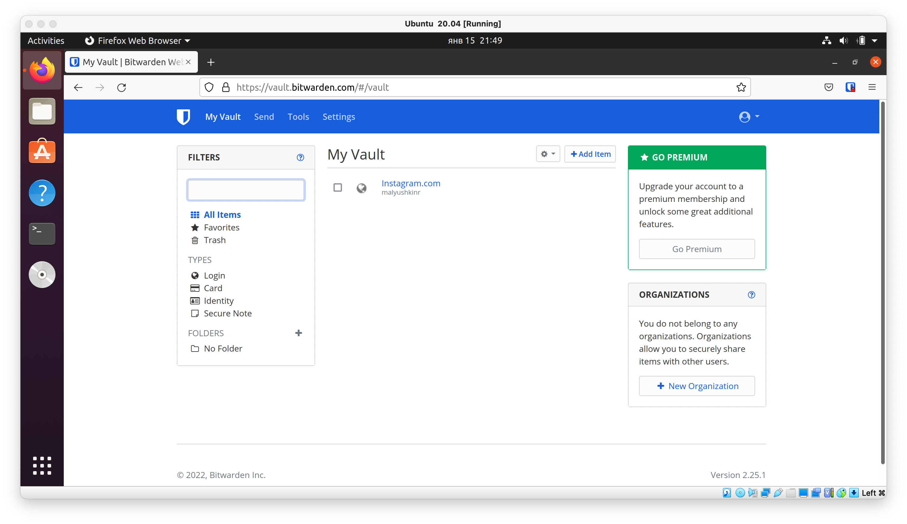
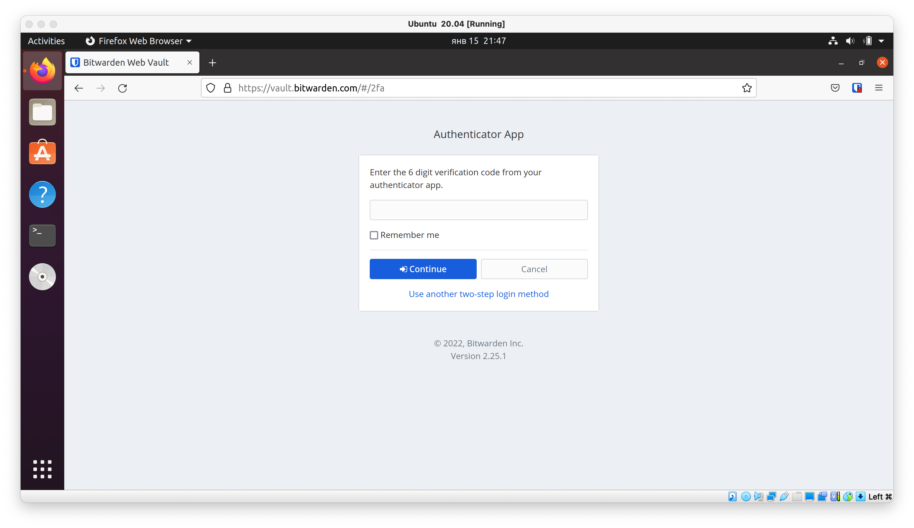
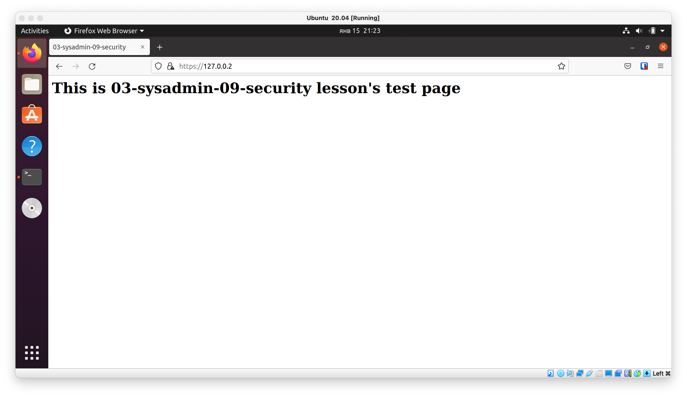
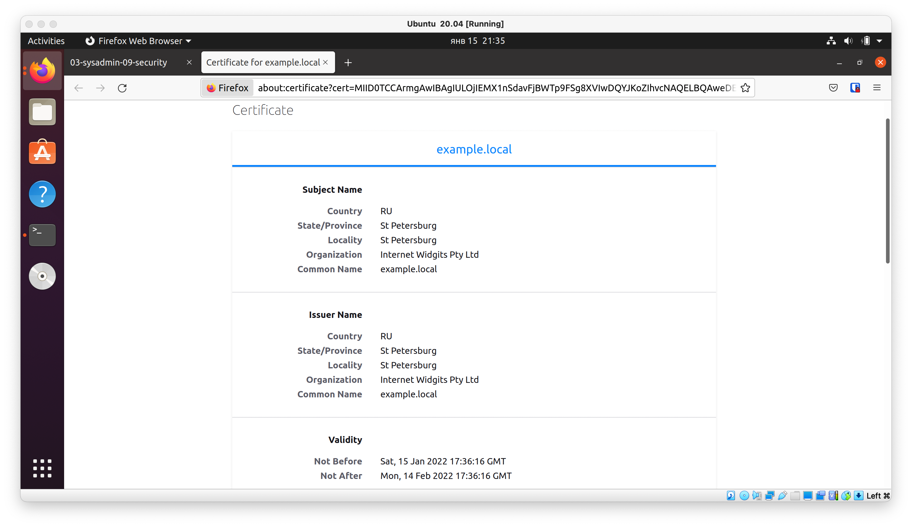
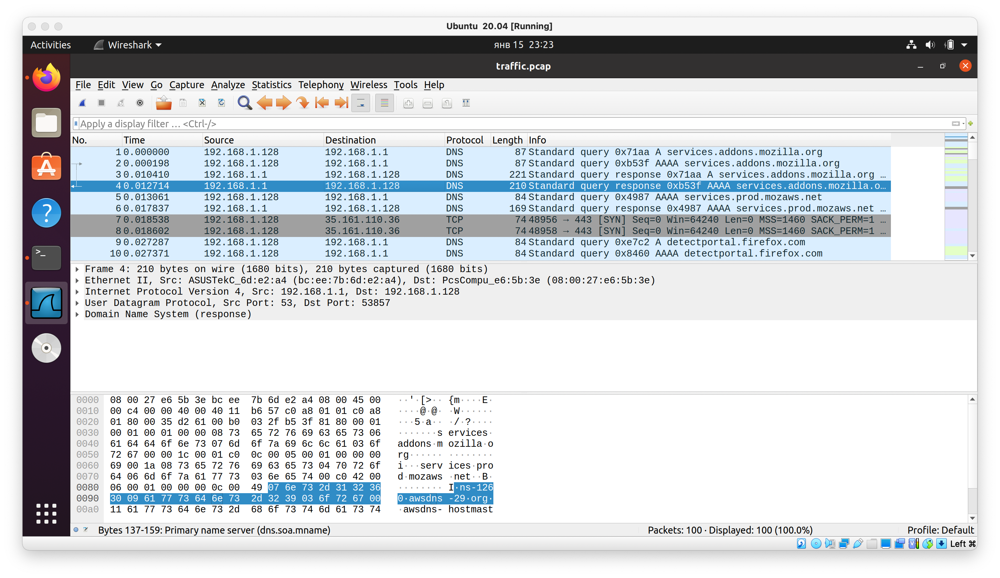

# Ответы 

1. Установите Bitwarden плагин для браузера. Зарегестрируйтесь и сохраните несколько паролей.

Установил плагин, добавил аккаунт Instagram.com:



---

2. Установите Google authenticator на мобильный телефон. Настройте вход в Bitwarden акаунт через Google authenticator OTP.

Настроил вход через Google authenticator OTP:



---

3. Установите apache2, сгенерируйте самоподписанный сертификат, настройте тестовый сайт для работы по HTTPS.

Для генерации файлов сертификата использовали пакет `openssl`: 

```bash
roman@roman-VirtualBox:~$ openssl req -new -x509 -days 30 -keyout apache2-example.key -out sapache2-example.pem
roman@roman-VirtualBox:~$ sudo cp apache2-example.pem /etc/ssl/certs/
roman@roman-VirtualBox:~$ sudo cp apache2-example.key /etc/ssl/private/
```

HTML-страница `127.0.0.2`:

```bash
roman@roman-VirtualBox:~$ cat /var/www/127.0.0.2/index.html 
<html>
	<head>
		<title>03-sysadmin-09-security</title>
	</head>
	<body>
		<h1>This is <b>03-sysadmin-09-security lesson's</b> test page</h1>
	</body>
</html>
```

Conf-файл Apache2 для страницы `127.0.0.2`, (указали пути для файлов сертификата):

```bash
roman@roman-VirtualBox:~$ cat /etc/apache2/sites-available/127.0.0.2.conf 
<VirtualHost *:443>
   ServerName 127.0.0.2
   DocumentRoot /var/www/127.0.0.2

   SSLEngine on
   SSLCertificateFile /etc/ssl/certs/apache2-example.pem
   SSLCertificateKeyFile /etc/ssl/private/apache2-example.key
</VirtualHost>
```

После перезагрузки сервиса apache2 и ввода pass phrase можно переходить по адресу `https://127.0.0.2/`: 



Информация о сертификате:



---

4. Проверьте на TLS уязвимости произвольный сайт в интернете (кроме сайтов МВД, ФСБ, МинОбр, НацБанк, РосКосмос, РосАтом, РосНАНО и любых госкомпаний, объектов КИИ, ВПК ... и тому подобное).

Проверил сайт Apple:

```bash
roman@roman-VirtualBox:~$ testssl -U --sneaky https://www.apple.com/

No engine or GOST support via engine with your /usr/bin/openssl

###########################################################
    testssl       3.0 from https://testssl.sh/

      This program is free software. Distribution and
             modification under GPLv2 permitted.
      USAGE w/o ANY WARRANTY. USE IT AT YOUR OWN RISK!

       Please file bugs @ https://testssl.sh/bugs/

###########################################################

 Using "OpenSSL 1.1.1f  31 Mar 2020" [~79 ciphers]
 on roman-VirtualBox:/usr/bin/openssl
 (built: "Nov 24 13:20:48 2021", platform: "debian-amd64")


 Start 2022-01-15 22:00:25        -->> 95.100.188.232:443 (www.apple.com) <<--

 Further IP addresses:   2a02:2d8:0:7999::1aca 2a02:2d8:0:798f::1aca 
 rDNS (95.100.188.232):  a95-100-188-232.deploy.static.akamaitechnologies.com.
 Service detected:       HTTP


 Testing vulnerabilities 

 Heartbleed (CVE-2014-0160)                not vulnerable (OK), no heartbeat extension
 CCS (CVE-2014-0224)                       not vulnerable (OK)
 Ticketbleed (CVE-2016-9244), experiment.  not vulnerable (OK), no session tickets
 ROBOT                                     not vulnerable (OK)
 Secure Renegotiation (RFC 5746)           supported (OK)
 Secure Client-Initiated Renegotiation     not vulnerable (OK)
 CRIME, TLS (CVE-2012-4929)                not vulnerable (OK)
 BREACH (CVE-2013-3587)                    potentially NOT ok, uses gzip HTTP compression. - only supplied "/" tested
                                           Can be ignored for static pages or if no secrets in the page
 POODLE, SSL (CVE-2014-3566)               not vulnerable (OK)
 TLS_FALLBACK_SCSV (RFC 7507)              No fallback possible (OK), no protocol below TLS 1.2 offered
 SWEET32 (CVE-2016-2183, CVE-2016-6329)    not vulnerable (OK)
 FREAK (CVE-2015-0204)                     not vulnerable (OK)
 DROWN (CVE-2016-0800, CVE-2016-0703)      not vulnerable on this host and port (OK)
                                           make sure you don't use this certificate elsewhere with SSLv2 enabled services
                                           https://censys.io/ipv4?q=A5F17AFA5F0B3D7AD316BE87550327BC17B8F176CC83E81BD3D3FDB0E1DE3DA4 could help you to find out
 LOGJAM (CVE-2015-4000), experimental      not vulnerable (OK): no DH EXPORT ciphers, no DH key detected with <= TLS 1.2
 BEAST (CVE-2011-3389)                     not vulnerable (OK), no SSL3 or TLS1 LUCKY13 (CVE-2013-0169), experimental     potentially VULNERABLE, uses cipher block chaining (CBC) ciphers with TLS. Check patches
 RC4 (CVE-2013-2566, CVE-2015-2808)        no RC4 ciphers detected (OK)

 Done 2022-01-15 22:00:55 [  32s] -->> 95.100.188.232:443 (www.apple.com) <<--
```

Строка 

```bash
BREACH (CVE-2013-3587)                    potentially NOT ok, uses gzip HTTP compression. - only supplied "/" tested
```

говорит о возможной уязвимости.

---

5. Установите на Ubuntu ssh сервер, сгенерируйте новый приватный ключ. Скопируйте свой публичный ключ на другой сервер. Подключитесь к серверу по SSH-ключу.

Для выполнения задания был использовано 2 сервера:
- MacBook (локальная машина)
- VirtualBox Ubuntu 20.04 (виртуальная машина)

**VirtualBox Ubuntu 20.04**

Установим `ssh`:

```bash
roman@roman-VirtualBox:~$ sudo apt install openssh-server
roman@roman-VirtualBox:~$ sudo systemctl enable ssh
```

Выясним ip–адрес:

```bash
roman@roman-VirtualBox:~$ ip addr show
...
2: enp0s3: <BROADCAST,MULTICAST,UP,LOWER_UP> mtu 1500 qdisc fq_codel state UP group default qlen 1000
    link/ether 08:00:27:e6:5b:3e brd ff:ff:ff:ff:ff:ff
    inet 192.168.1.128/24 brd 192.168.1.255 scope global dynamic noprefixroute enp0s3
       valid_lft 85311sec preferred_lft 85311sec
    inet6 fe80::daeb:db58:7dfa:d79e/64 scope link noprefixroute 
       valid_lft forever preferred_lft forever
3: enp0s8: <BROADCAST,MULTICAST,UP,LOWER_UP> mtu 1500 qdisc fq_codel state UP group default qlen 1000

...
```

Адрес: `192.168.1.128`.

**MacBook**

Затем из локального устройства скопируем публичный ключ на виртуальную машину:

```bash
ssh-copy-id -i ~/.ssh/id_rsa.pub roman@192.168.1.128
```

После этого подключение к виртуальной машине по SSH с локального устройства работает без пароля:

```bash
romanmaliushkin@MBP-admin ~ % ssh roman@192.168.1.128
Welcome to Ubuntu 20.04.3 LTS (GNU/Linux 5.11.0-46-generic x86_64)

 * Documentation:  https://help.ubuntu.com
 * Management:     https://landscape.canonical.com
 * Support:        https://ubuntu.com/advantage

4 updates can be applied immediately.
4 of these updates are standard security updates.
To see these additional updates run: apt list --upgradable

Your Hardware Enablement Stack (HWE) is supported until April 2025.
Last login: Sat Jan 15 23:04:41 2022 from 192.168.1.143
roman@roman-VirtualBox:~$
```

--- 

6. Переименуйте файлы ключей из задания 5. Настройте файл конфигурации SSH клиента, так чтобы вход на удаленный сервер осуществлялся по имени сервера.

Настроим файл конфигурации:

```bash
romanmaliushkin@MBP-admin % cat ~/.ssh/config
Host vm-ubuntu
	HostName 192.168.1.128
	IdentityFile ~/.ssh/id_rsa
	User roman
```

Заходим на `vm-ubuntu`:

```bash
romanmaliushkin@MBP-admin % ssh vm-ubuntu
Welcome to Ubuntu 20.04.3 LTS (GNU/Linux 5.11.0-46-generic x86_64)

 * Documentation:  https://help.ubuntu.com
 * Management:     https://landscape.canonical.com
 * Support:        https://ubuntu.com/advantage

4 updates can be applied immediately.
4 of these updates are standard security updates.
To see these additional updates run: apt list --upgradable

Your Hardware Enablement Stack (HWE) is supported until April 2025.
Last login: Sat Jan 15 23:16:40 2022 from 192.168.1.143
```

---

7. Соберите дамп трафика утилитой tcpdump в формате pcap, 100 пакетов. Откройте файл pcap в Wireshark.

Соберём трафик:

```bash
roman@roman-VirtualBox:~/Documents$ sudo tcpdump -w traffic.pcap -c 100
```

Файл [traffic.pcap](traffic.pcap), открытый в Wireshark:

