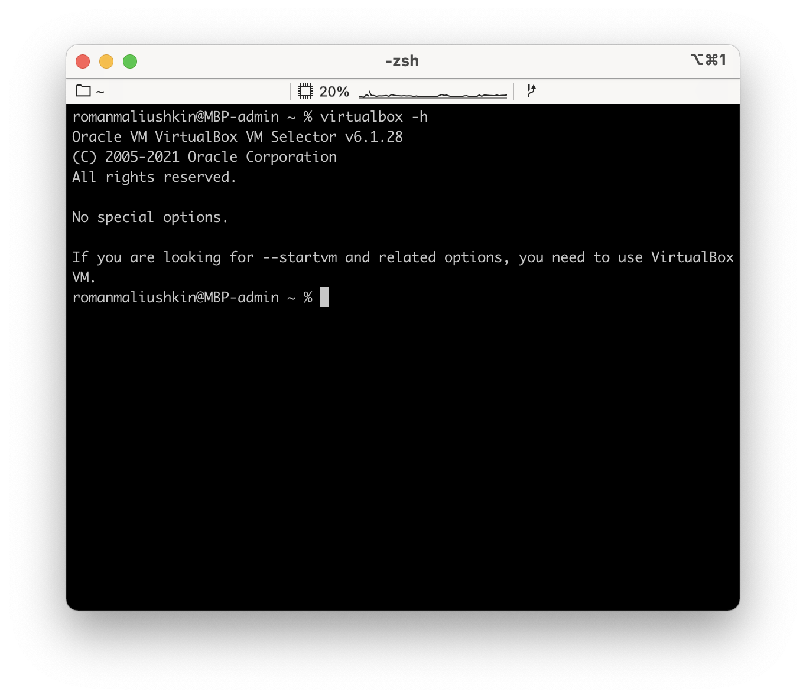
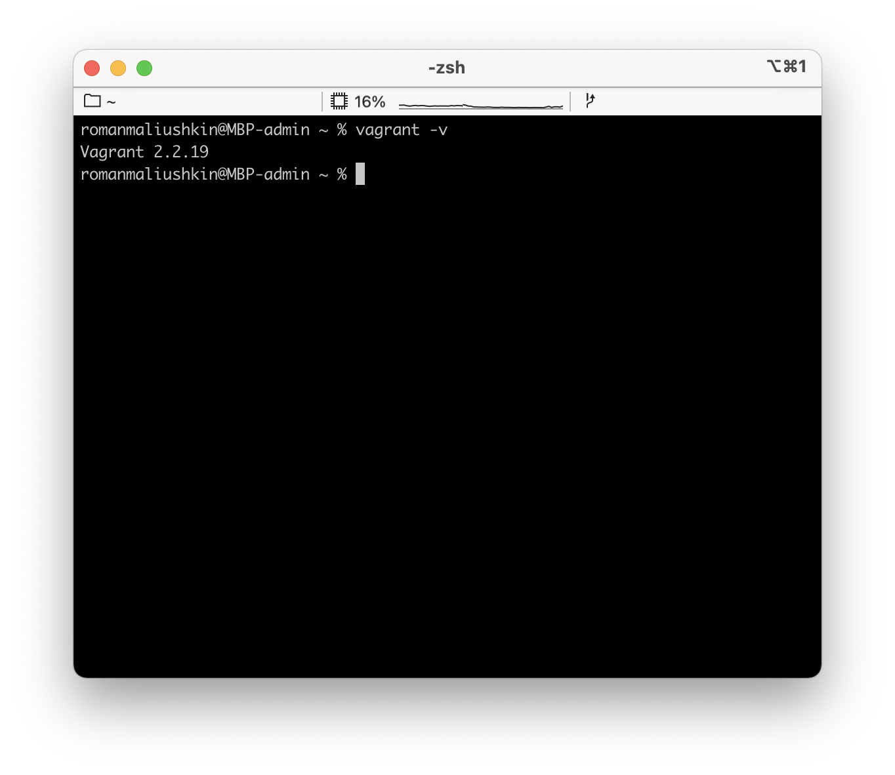
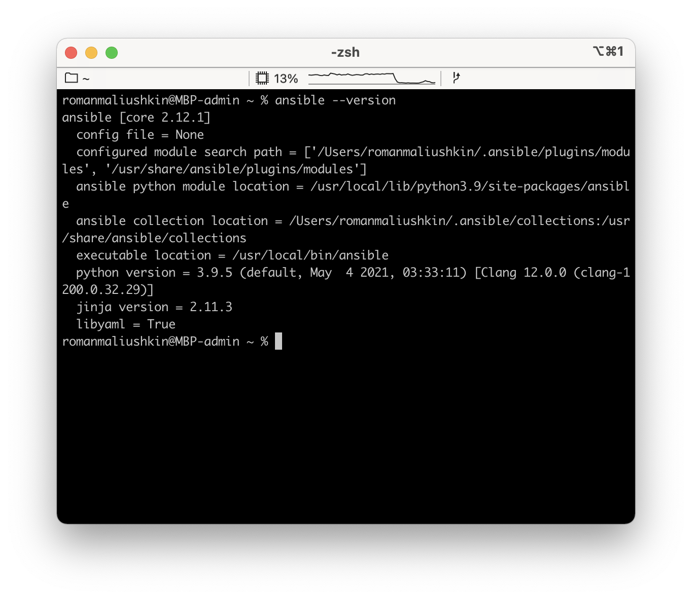
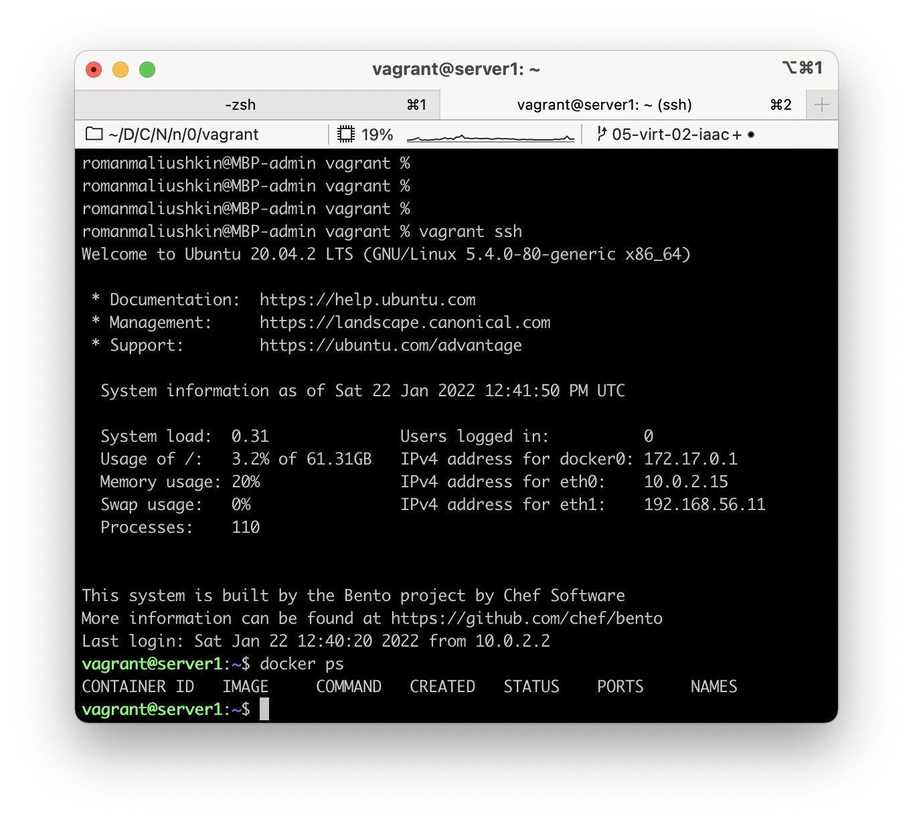

# Практическое задание по теме «Применение принципов IaaC в работе с виртуальными машинами»

## Задача 1

- Опишите своими словами основные преимущества применения на практике IaaC паттернов.
- Какой из принципов IaaC является основополагающим?

1. Основные преимущества применения IaaC паттернов:
- **CI (Continuous Integration)** — принцип CI предполагает слияние рабочих веток в основную ветку и автоматизированную пересборку проекта и запуск тестов. Позволяет избавить разработчиков от ручных действий и выявлять проблемы на сразу после пересборки.   
- **CD (Continuous Delivery)** — принцип CD (delivery) предполагает отправлять валидные доработки в dev-окружения по нажатию кнопки. В случае обнаружения проблем можно откатиться до предыдущей стабильной версии.
- **CD (Continuous Deployment)** — принцип CD (deployment) предполагает полную автоматизацию развёртывания доработок в dev-окружения. Однако релиз в production всё ещё в под ручным управлением, для минимизации бизнес-рисков.   

2. Основопологающим принципом IaaC является **индемпотентность**. Индемпотентность обеспечивает идентичный результат при повторном выполнении каких-либо операций.

---

## Задача 2

- Чем Ansible выгодно отличается от других систем управления конфигурациями?
- Какой, на ваш взгляд, метод работы систем конфигурации более надёжный push или pull?

1. Ansible реализован как open source решение. Для корпоративного использования доступна проприетарная версия — Ansible Tower. Ansible поддерживает как декларативный, так и императивный подходы. Относительно низкий порог входа. В сети можно найти много примеров использования и подробную документацию.
2. Основная разница между методами push и pull заключается в том, кто инициирует изменения на гостевой машине. На мой взгляд, более надёжно использовать метод push. Это позволит избежать ситуации, когда десятки или сотни гостевых машин начинают одновременно запрашивать изменения с мастер-сервера.

---

## Задача 3

Установить на личный компьютер:

- VirtualBox
- Vagrant
- Ansible

*Приложить вывод команд установленных версий каждой из программ, оформленный в markdown.*

1. **VirtualBox** (Oracle VM VirtualBox VM Selector v6.1.28)



2. **Vagrant** (Vagrant 2.2.19)



3. Ansible (Ansible [core 2.12.1])



---

## Задача 4 (*)

Воспроизвести практическую часть лекции самостоятельно.

- Создать виртуальную машину.
- Зайти внутрь ВМ, убедиться, что Docker установлен с помощью команды

```
docker ps
```

Загрузил настройки Vagrant и Ansible по [ссылке](https://github.com/netology-code/virt-homeworks/tree/virt-11/05-virt-02-iaac/src). Изменил IP адрес и запустил `vagrant up`. Затем зашёл в машину `vagrant ssh`:


