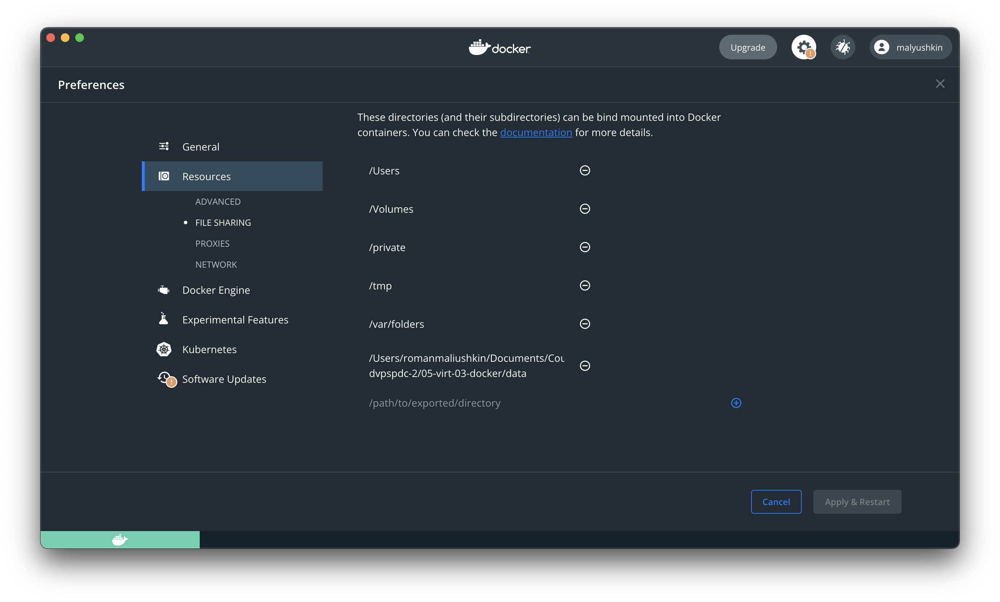

# Практическое задание по теме «Введение. Экосистема. Архитектура. Жизненный цикл Docker контейнера»

## Задача 1

Сценарий выполения задачи:

- создайте свой репозиторий на https://hub.docker.com;
- выберете любой образ, который содержит веб-сервер Nginx;
- создайте свой fork образа;
- реализуйте функциональность:
запуск веб-сервера в фоне с индекс-страницей, содержащей HTML-код ниже:
```
<html>
<head>
Hey, Netology
</head>
<body>
<h1>I’m DevOps Engineer!</h1>
</body>
</html>
```
Опубликуйте созданный форк в своем репозитории и предоставьте ответ в виде ссылки на https://hub.docker.com/username_repo.

Создадим [Dockerfile](app/Dockerfile), в нём пропишем команду `COPY` для перезаписи стартовой страницы Nginx:

```docker
FROM nginx:latest
COPY ./index.html /usr/share/nginx/html/index.html
```

Построим Docker-образ `webserver`:

```bash
docker build -t webserver .
```

Проверим что он корректно загрузился:

```bash
╰─➤  docker image ls
REPOSITORY        TAG           IMAGE ID       CREATED         SIZE
webserver         latest        aba6f1bb3870   2 minutes ago   141MB
grafana/grafana   latest        4a34578e4374   6 days ago      274MB
postgres          13            0896a8e0282d   2 weeks ago     371MB
apache/airflow    2.2.3         7b4bd8a0e502   4 weeks ago     1.02GB
redis             latest        7614ae9453d1   4 weeks ago     113MB
debian            buster-slim   0762bb4af96a   4 weeks ago     69.3MB
```

`IMAGE ID aba6f1bb3870`

Запустим Docker-контейнер `netology` в фоновом режиме. Используем `8080` порт:

```docker
docker run -it --rm -d -p 8080:80 --name netology webserver
```

Откроем страницу на локальном устройстве:


Для загрузки в Docker Hub добавим тег `malyushkin/webserver:latest`:

```bash
docker image tag webserver malyushkin/webserver:latest
```

Опубликуем Docker-образ по адресу `malyushkin/webserver`:

```bash
docker image tag webserver malyushkin/webserver:latest
```

Ссылка на Docker-образ: https://hub.docker.com/r/malyushkin/webserver

---

## Задача 2

Посмотрите на сценарий ниже и ответьте на вопрос:
"Подходит ли в этом сценарии использование Docker контейнеров или лучше подойдет виртуальная машина, физическая машина? Может быть возможны разные варианты?"

Детально опишите и обоснуйте свой выбор.

--

Сценарий:

1. Высоконагруженное монолитное java веб-приложение;

Docker-контейнер удобен для реализации монолитного web-приложения. Высокая нагрузка не противоречит подходу к контенеризации. Вероятно с помощью контейнера можно будет распределять нагрузку.

2. Nodejs веб-приложение;

Для развёртывания web-приложения удобно использовать Docker-контейнер. Перед релизом контейнер можно запускать на dev- и test- средах для тестирования. Можно воспользоваться [готовым образом](https://hub.docker.com/_/node).

3. Мобильное приложение c версиями для Android и iOS;

Поверхностное изучение вопроса контейнеризации проектов мобильных приложений показало, что: 

* Android-проект можно контейниризировать; 
* iOS — нельзя. 

В связи с чем предлагаю использовать виртуализацпю.

4. Шина данных на базе Apache Kafka; 

Для конфигурации Apache Kafka можно использовать Docker-контейнер. В случае необходимости разворачивать шину на других, более мощных, серверах Docker-контейнер можно перенести.

5. Elasticsearch кластер для реализации логирования продуктивного веб-приложения - три ноды elasticsearch, два logstash и две ноды kibana; 

Так как предлагается разворачивать несколько нод приложения, а так же все приведённые проекта имеют официальные образы в Docker Hub ([Elasticsearch](https://hub.docker.com/_/elasticsearch), [Logstash](https://hub.docker.com/_/logstash), [Kibana](https://hub.docker.com/_/kibana)) предлагаю использовать Docker-контейнер. При этом Elasticsearch должен быть stateful-приложением, так как это база данных.

6. Мониторинг-стек на базе Prometheus и Grafana; 

Prometheus и Grafana являются приложениями с web-интерфейсом. По сути те же web-приложения. В таких случаях удобно использовать Docker-контейнер.

7. MongoDB, как основное хранилище данных для java-приложения; 

Для MongoDB так же можно использовать Docker-контейнер, например, с официального [образа](https://hub.docker.com/_/mongo). Как и в случае с Elasticsearch — это будет stateful-приложение, для сохранения данных после остановки контейнера. 

8. Gitlab сервер для реализации CI/CD процессов и приватный (закрытый) Docker Registry.

Gitlab сервер так же удобно разворачивать внутри Docker-контейнера. Такой контейнер легко переносить на различные машины, настраивать и тд.

---

## Задача 3

1. Запустите первый контейнер из образа ***centos*** c любым тэгом в фоновом режиме, подключив папку ```/data``` из текущей рабочей директории на хостовой машине в ```/data``` контейнера;

Добавим папку [data](data) в Docker File sharing:



Запустим **Centos**:

```bash
─➤  docker run -v /Users/romanmaliushkin/Documents/Courses/Netology/netology-dvpspdc-2/05-virt-03-docker/data:/data -t -d --name my_centos centos:latest

338cb50fa6e85fe74daf5f24e4269f005b473285c5a89d446fba23e8a9f8087d
```

2. Запустите второй контейнер из образа ***debian*** в фоновом режиме, подключив папку ```/data``` из текущей рабочей директории на хостовой машине в ```/data``` контейнера; 

Запустим **Debian**:

```bash
╰─➤  docker run -v /Users/romanmaliushkin/Documents/Courses/Netology/netology-dvpspdc-2/05-virt-03-docker/data:/data -t -d --name my_debian debian:latest                   127 ↵

80cc4b7b88f8f8dce64399691f48c936d1b7bfb670fd3886b20f9399888255fa
```

Проверим `docker ps`:

```bash
╰─➤  docker ps
CONTAINER ID   IMAGE           COMMAND                  CREATED          STATUS          PORTS                  NAMES
80cc4b7b88f8   debian:latest   "bash"                   39 seconds ago   Up 37 seconds                          my_debian
338cb50fa6e8   centos:latest   "/bin/bash"              3 minutes ago    Up 3 minutes                           my_centos
7e236ca4c5dd   webserver       "/docker-entrypoint.…"   2 hours ago      Up 2 hours      0.0.0.0:8080->80/tcp   web
```

3. Подключитесь к первому контейнеру с помощью ```docker exec``` и создайте текстовый файл любого содержания в ```/data```; 

```bash
╰─➤  docker exec -it my_centos /bin/bash
[root@338cb50fa6e8 /]# ls
bin  data  dev	etc  home  lib	lib64  lost+found  media  mnt  opt  proc  root	run  sbin  srv	sys  tmp  usr  var
[root@338cb50fa6e8 /]# cd data/
[root@338cb50fa6e8 data]# echo "some text" > some_text
[root@338cb50fa6e8 data]# ls
some_text
```

4. Добавьте еще один файл в папку ```/data``` на хостовой машине; 

```bash
echo "some text from host" > some_text_from_host
```

5. Подключитесь во второй контейнер и отобразите листинг и содержание файлов в ```/data``` контейнера.

