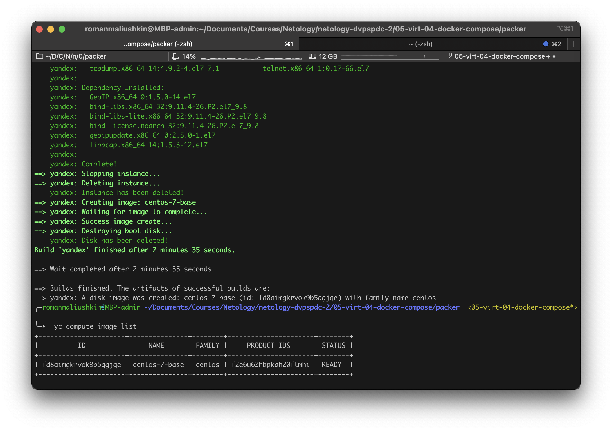
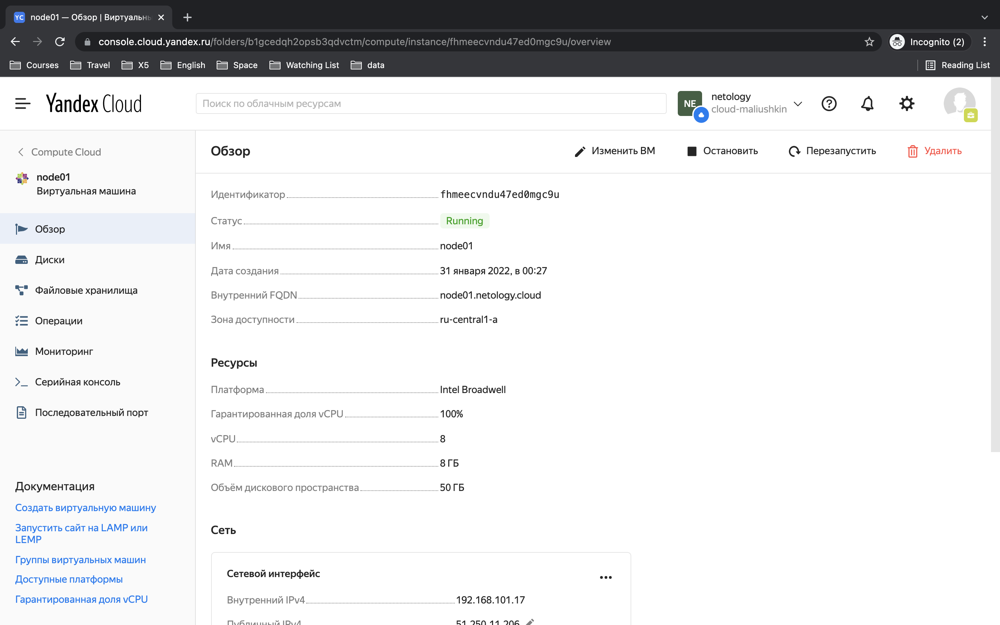
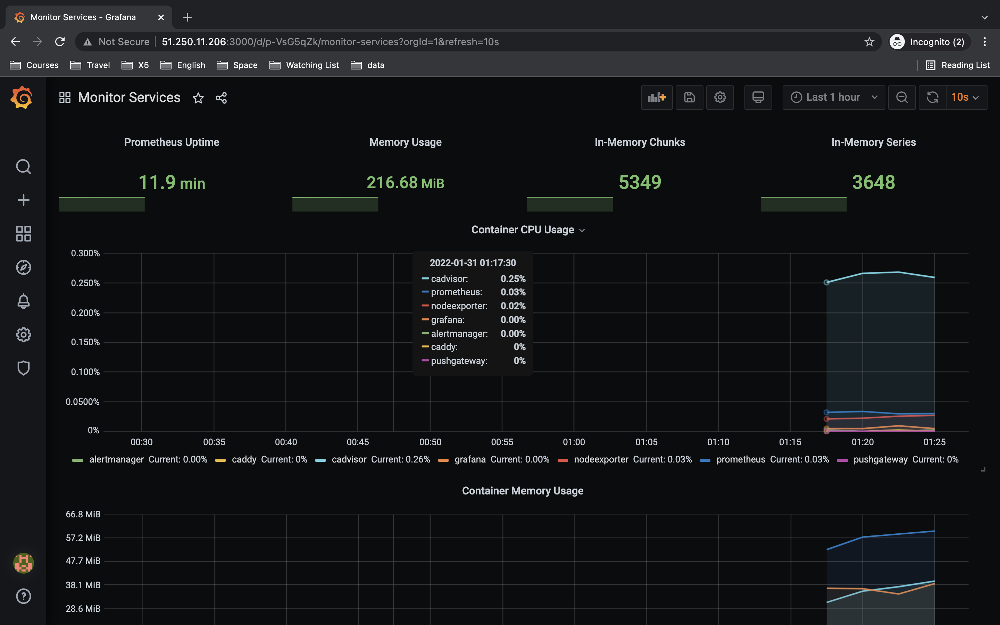
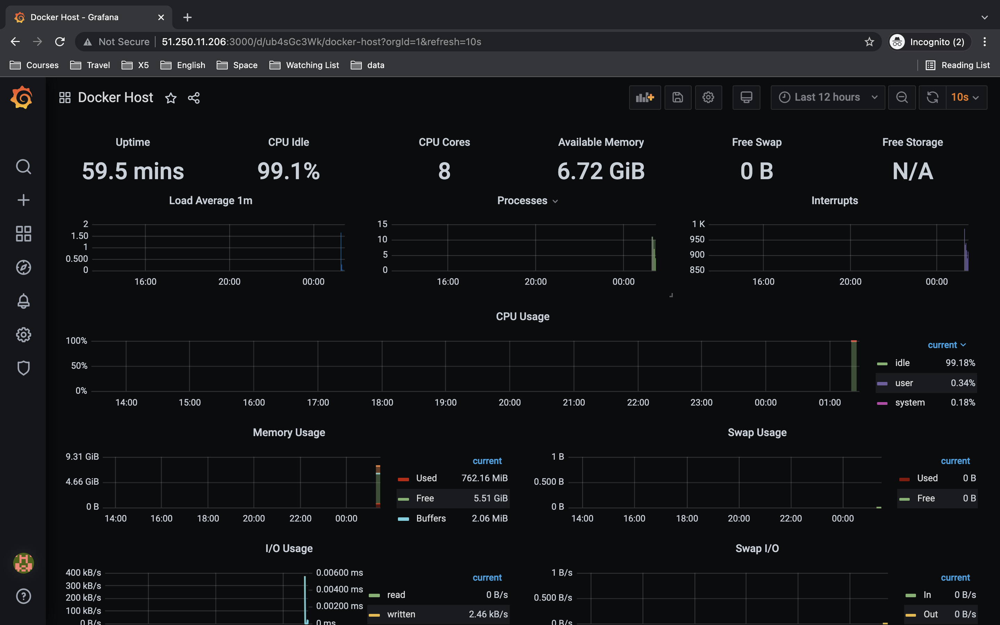

# Практическое задание по теме «Оркестрация группой Docker контейнеров на примере Docker Compose»

## Задача 1

Создать собственный образ операционной системы с помощью Packer.

Для получения зачета, вам необходимо предоставить:
- Скриншот страницы, как на слайде из презентации (слайд 37).

**Yandex.Cloud**

Установим Yandex.Cloud CLI и проверим версию:

```bash
╰─➤  curl https://storage.yandexcloud.net/yandexcloud-yc/install.sh | bash
╰─➤  yc --version                                                                                             130 ↵
Yandex.Cloud CLI 0.87.0 darwin/amd64
```

Инициализируем профиль, сеть и подсеть: 

```bash
╰─➤  yc init                                                                                                                                                                                            1 ↵
Welcome! This command will take you through the configuration process.
Pick desired action:
 [1] Re-initialize this profile 'netology' with new settings
 [2] Create a new profile
 [3] Switch to and re-initialize existing profile: 'default'
Please enter your numeric choice: 1
Please go to https://oauth.yandex.ru/authorize?response_type=token&client_id=1a6990aa636648e9b2ef855fa7bec2fb in order to obtain OAuth token.

Please enter OAuth token: [AQAAAAAJ0*********************TUv09uQQE] AQAAAAAJ0uybAATuwY2qz02f_EvtnvTUv09uQQE
You have one cloud available: 'cloud-maliushkin' (id = b1grvrc5vladcufpdjjn). It is going to be used by default.
Please choose folder to use:
 [1] default (id = b1gac81bedjjh0b9s6f4)
 [2] Create a new folder
Please enter your numeric choice: 2
Please enter a folder name: netology
Your current folder has been set to 'netology' (id = b1gcedqh2opsb3qdvctm).
Do you want to configure a default Compute zone? [Y/n] Y
Which zone do you want to use as a profile default?
 [1] ru-central1-a
 [2] ru-central1-b
 [3] ru-central1-c
 [4] Don't set default zone
Please enter your numeric choice: 1
Your profile default Compute zone has been set to 'ru-central1-a'.

╰─➤  yc config list                                                                                                                                                                                   127 ↵
token: AQAAAAAJ0uybAATuwY2qz02f_EvtnvTUv09uQQE
cloud-id: b1grvrc5vladcufpdjjn
folder-id: b1gcedqh2opsb3qdvctm
compute-default-zone: ru-central1-a

╰─➤  yc vpc network create --name net --labels my-label=netology --description "my first network via yc"
id: enppho06atpesip2qcv5
folder_id: b1gcedqh2opsb3qdvctm
created_at: "2022-01-30T20:22:47Z"
name: net
description: my first network via yc
labels:
  my-label: netology
  
╰─➤  yc vpc subnet create --name my-subnet-a --zone ru-central1-a --range 10.1.2.0/24 --network-name net --description "my first subnet via yc"
id: e9bkcqh11q7r66g8o1lb
folder_id: b1gcedqh2opsb3qdvctm
created_at: "2022-01-30T20:23:22Z"
name: my-subnet-a
description: my first subnet via yc
network_id: enppho06atpesip2qcv5
zone_id: ru-central1-a
v4_cidr_blocks:
- 10.1.2.0/24
```

**Packer**

Скачаем Packer по [ссылке](https://releases.hashicorp.com/packer/1.7.9/packer_1.7.9_darwin_amd64.zip) и скопируем в папку `/usr/local/bin/`. Проверим версию `packer`:

```bash
╰─➤  sudo cp ~/Downloads/packer /usr/local/bin
╰─➤  packer --version
1.7.9
```

Настроим конфигурационный файл [centos-7-base.json](packer/centos-7-base.json) и запустим образ:

```bash
╰─➤  packer validate centos-7-base.json
The configuration is valid.

╰─➤  packer build centos-7-base.json
...
    yandex: Complete!
==> yandex: Stopping instance...
==> yandex: Deleting instance...
    yandex: Instance has been deleted!
==> yandex: Creating image: centos-7-base
==> yandex: Waiting for image to complete...
==> yandex: Success image create...
==> yandex: Destroying boot disk...
    yandex: Disk has been deleted!
Build 'yandex' finished after 2 minutes 35 seconds.

==> Wait completed after 2 minutes 35 seconds

==> Builds finished. The artifacts of successful builds are:
--> yandex: A disk image was created: centos-7-base (id: fd8aimgkrvok9b5qgjqe) with family name centos
```

```bash
╰─➤  yc compute image list
+----------------------+---------------+--------+----------------------+--------+
|          ID          |     NAME      | FAMILY |     PRODUCT IDS      | STATUS |
+----------------------+---------------+--------+----------------------+--------+
| fd8aimgkrvok9b5qgjqe | centos-7-base | centos | f2e6u62hbpkah20ftmhi | READY  |
+----------------------+---------------+--------+----------------------+--------+
```

Результат:



По окончании работ удалим созданные сеть и подсеть:

```bash
yc vpc subnet delete --name my-subnet-a && yc vpc network delete --name net
done (7s)
```

---

## Задача 2

Создать вашу первую виртуальную машину в Яндекс.Облаке.

Для получения зачета, вам необходимо предоставить:
- Скриншот страницы свойств созданной ВМ.

**Terraform**

Скачаем Terraform по [ссылке](https://releases.hashicorp.com/terraform/1.1.4/terraform_1.1.4_darwin_amd64.zip) и скопируем в папку `/usr/local/bin/`. Проверим версию `terraform`:

```bash
╰─➤  cp ~/Downloads/terraform /usr/local/bin
╰─➤  terraform --version                                                                                                            127 ↵
Terraform v1.1.4
on darwin_amd64
```

В интерфейсе Яндекс Облака создадим сервисный аккаунт `srv-test`. Для этого аккаунта создадим ключ авторизации:

```bash
╰─➤  yc iam key create --folder-name netology --service-account-name srv-test --output key.json
id: ajetg66c73j51u12ibpa
service_account_id: ajeh3mpp15e72hvv9re3
created_at: "2022-01-30T21:20:07.589430939Z"
key_algorithm: RSA_2048
```

Создадим новый профиль `create srv-test-profile` и установим для него созданный ключ активации ([key.json](terraform/key.json)): 

```bash
╰─➤ yc config profile create srv-test-profile
╰─➤ yc config profile list
default
netology
srv-test-profile ACTIVE

╰─➤ yc config set service-account-key key.json
```

Инициализируем `terraform`:

```bash
╰─➤  terraform init

Initializing the backend...

Initializing provider plugins...
- Finding latest version of yandex-cloud/yandex...
- Installing yandex-cloud/yandex v0.70.0...
- Installed yandex-cloud/yandex v0.70.0 (self-signed, key ID E40F590B50BB8E40)

Partner and community providers are signed by their developers.
If you'd like to know more about provider signing, you can read about it here:
https://www.terraform.io/docs/cli/plugins/signing.html

Terraform has created a lock file .terraform.lock.hcl to record the provider
selections it made above. Include this file in your version control repository
so that Terraform can guarantee to make the same selections by default when
you run "terraform init" in the future.

Terraform has been successfully initialized!

You may now begin working with Terraform. Try running "terraform plan" to see
any changes that are required for your infrastructure. All Terraform commands
should now work.

If you ever set or change modules or backend configuration for Terraform,
rerun this command to reinitialize your working directory. If you forget, other
commands will detect it and remind you to do so if necessary.
```

После проверки плана `terraform plan` применим его:

```bash
terraform apply
...
yandex_compute_instance.node01: Creating...
yandex_compute_instance.node01: Still creating... [10s elapsed]
yandex_compute_instance.node01: Still creating... [20s elapsed]
yandex_compute_instance.node01: Still creating... [30s elapsed]
yandex_compute_instance.node01: Still creating... [40s elapsed]
yandex_compute_instance.node01: Creation complete after 43s [id=fhmeecvndu47ed0mgc9u]

Apply complete! Resources: 3 added, 0 changed, 0 destroyed.
```

Результат:



---

## Задача 3

Создать ваш первый готовый к боевой эксплуатации компонент мониторинга, состоящий из стека микросервисов.

Для получения зачета, вам необходимо предоставить:
- Скриншот работающего веб-интерфейса Grafana с текущими метриками.

Внесём несколько правок в [provision.yml](ansible/provision.yml) в части установки пакетов: 

```bash
      - name: Installing tools
        yum:
          name: "{{ packages }}"
          state: present
          update_cache: yes
        vars:
          packages:
            - curl
            - git
```

Запускаем `ansible-playbook`:

```bash
╰─➤ ansible-playbook provision.yml                                                                                                                      2 ↵

PLAY [nodes] ************************************************************************************************************************************************

TASK [Gathering Facts] **************************************************************************************************************************************
ok: [node01.netology.cloud]

TASK [Create directory for ssh-keys] ************************************************************************************************************************
ok: [node01.netology.cloud]

TASK [Adding rsa-key in /root/.ssh/authorized_keys] *********************************************************************************************************
ok: [node01.netology.cloud]

TASK [Checking DNS] *****************************************************************************************************************************************
changed: [node01.netology.cloud]

TASK [Installing tools] *************************************************************************************************************************************
ok: [node01.netology.cloud]

TASK [Add docker repository] ********************************************************************************************************************************
changed: [node01.netology.cloud]

TASK [Installing docker package] ****************************************************************************************************************************
changed: [node01.netology.cloud]

TASK [Enable docker daemon] *********************************************************************************************************************************
changed: [node01.netology.cloud]

TASK [Install docker-compose] *******************************************************************************************************************************
changed: [node01.netology.cloud]

TASK [Synchronization] **************************************************************************************************************************************
changed: [node01.netology.cloud]

TASK [Pull all images in compose] ***************************************************************************************************************************
changed: [node01.netology.cloud]

TASK [Up all services in compose] ***************************************************************************************************************************
changed: [node01.netology.cloud]

PLAY RECAP **************************************************************************************************************************************************
node01.netology.cloud      : ok=12   changed=8    unreachable=0    failed=0    skipped=0    rescued=0    ignored=0
```

После выполнения всех задач, можем зайти на ВМ и проверить запущенные контейнеры `docker`:

```bash
╰─➤ ssh centos@51.250.11.206
[centos@node01 ~]$ sudo -i
[root@node01 ~]# docker ps
CONTAINER ID   IMAGE                                       COMMAND                  CREATED         STATUS                   PORTS                                                                              NAMES
9e2e61570bae   prom/prometheus:v2.17.1                     "/bin/prometheus --c…"   2 minutes ago   Up 2 minutes             9090/tcp                                                                           prometheus
65258868ef0b   stefanprodan/caddy                          "/sbin/tini -- caddy…"   2 minutes ago   Up 2 minutes             0.0.0.0:3000->3000/tcp, 0.0.0.0:9090-9091->9090-9091/tcp, 0.0.0.0:9093->9093/tcp   caddy
56202a408eca   prom/alertmanager:v0.20.0                   "/bin/alertmanager -…"   2 minutes ago   Up 2 minutes             9093/tcp                                                                           alertmanager
7c39b1d4ca77   prom/pushgateway:v1.2.0                     "/bin/pushgateway"       2 minutes ago   Up 2 minutes             9091/tcp                                                                           pushgateway
51f7ea9d7c2c   grafana/grafana:7.4.2                       "/run.sh"                2 minutes ago   Up 2 minutes             3000/tcp                                                                           grafana
e5b8556be293   gcr.io/google-containers/cadvisor:v0.34.0   "/usr/bin/cadvisor -…"   2 minutes ago   Up 2 minutes (healthy)   8080/tcp                                                                           cadvisor
0b8650c62985   prom/node-exporter:v0.18.1                  "/bin/node_exporter …"   2 minutes ago   Up 2 minutes             9100/tcp                                                                           nodeexporter
```

Проверим микросервис Grafana на 3000 порте (http://51.250.11.206:3000/):





По окончании работ удалим узел terraform:

```bash
╰─➤ terraform destroy
```