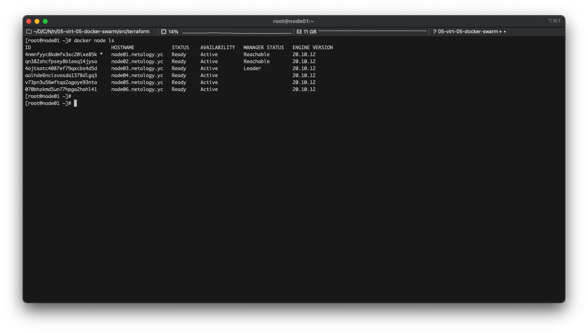
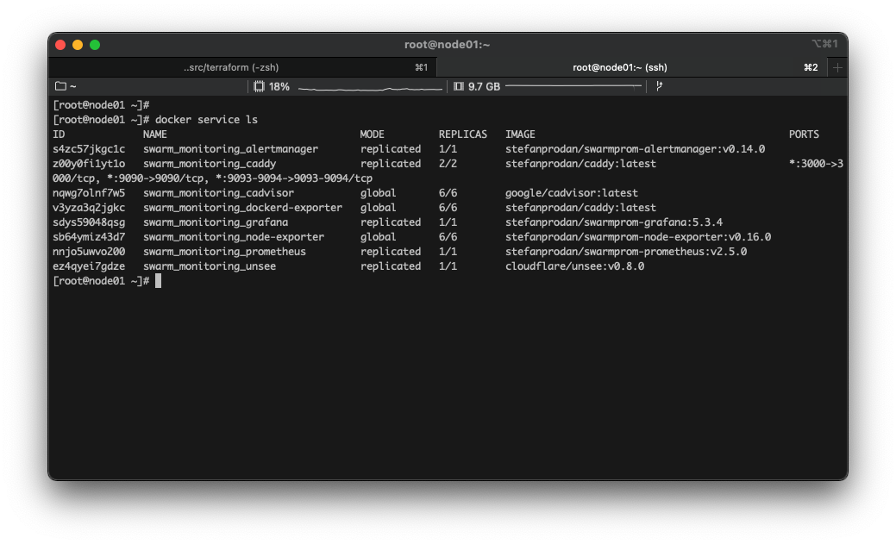

# Практическое задание по теме «Оркестрация кластером Docker контейнеров на примере Docker Swarm»

## Задача 1

Дайте письменные ответы на следующие вопросы:

- В чём отличие режимов работы сервисов в Docker Swarm кластере: replication и global?
- Какой алгоритм выбора лидера используется в Docker Swarm кластере?
- Что такое Overlay Network?

1. В чём отличие режимов работы сервисов в Docker Swarm кластере: replication и global?

Режим replication запускает сервис на указанном количестве нод. Количество задается командой `update --replicas=N`. Режим global запускает сервис на всех нодах кластера. [Источник](https://docs.docker.com/engine/swarm/how-swarm-mode-works/services/).

2. Какой алгоритм выбора лидера используется в Docker Swarm кластере?

Алгоритм Raft — лидером становится та нода, которая получила больше всего голосов.

3. Что такое Overlay Network?

Overlay Network — распределённая виртуальная сеть для обмена данными между контейнерами Docker Swarm.

---

## Задача 2

Создать ваш первый Docker Swarm кластер в Яндекс.Облаке

Для получения зачета, вам необходимо предоставить скриншот из терминала (консоли), с выводом команды:
```
docker node ls
```

Активируем профиль `netology`:

```bash
╰─➤  yc config profile activate netology
Profile 'netology' activated
╰─➤  yc config list
token: AQAAAAAJ0uybAATuwY2qz02f_EvtnvTUv09uQQE
cloud-id: b1grvrc5vladcufpdjjn
folder-id: b1gcedqh2opsb3qdvctm
compute-default-zone: ru-central1-a
```

Создадим сеть и подсеть:

```bash
╰─➤  yc vpc network create --name net --labels my-label=netology --description "my first network via yc"

id: enpdvdujgueh9a9g8cbu
folder_id: b1gcedqh2opsb3qdvctm
created_at: "2022-02-10T21:09:40Z"
name: net
description: my first network via yc
labels:
  my-label: netology
  
╰─➤  yc vpc subnet create --name my-subnet-a --zone ru-central1-a --range 10.1.2.0/24 --network-name net --description "my first subnet via yc"

id: e9b6apf55t8i7gqjjndn
folder_id: b1gcedqh2opsb3qdvctm
created_at: "2022-02-10T21:09:47Z"
name: my-subnet-a
description: my first subnet via yc
network_id: enpdvdujgueh9a9g8cbu
zone_id: ru-central1-a
v4_cidr_blocks:
- 10.1.2.0/24
```

Настроим [centos-7-base.json](src/packer/centos-7-base.json) и запустим Packer:

```bash
╰─➤  packer build centos-7-base.json
...
==> yandex: Success image create...
==> yandex: Destroying boot disk...
    yandex: Disk has been deleted!
Build 'yandex' finished after 2 minutes 53 seconds.

==> Wait completed after 2 minutes 53 seconds

==> Builds finished. The artifacts of successful builds are:
--> yandex: A disk image was created: centos-7-base (id: fd82k68tmvrr5cqcrrh2) with family name centos
```

Удалим созданные сеть и подсеть:

```bash
╰─➤  yc vpc subnet delete --name my-subnet-a && yc vpc network delete --name net
```

Скорректируем конфигурационные файлы Ansible (заменим `package` на `name`):
* [ansible/roles/docker-installation/tasks/main.yml](src/ansible/roles/docker-installation/tasks/main.yml) 
* [ansible/roles/install-tools/tasks/main.yml](src/ansible/roles/install-tools/tasks/main.yml)

Инициализируем Terraform `terraform init`, проверим план `terraform plan` и применим его:

```bash
╰─➤  terraform apply
...
null_resource.monitoring (local-exec): PLAY RECAP *********************************************************************
null_resource.monitoring (local-exec): node01.netology.yc         : ok=3    changed=1    unreachable=0    failed=0    skipped=0    rescued=0    ignored=0
null_resource.monitoring (local-exec): node02.netology.yc         : ok=2    changed=0    unreachable=0    failed=0    skipped=1    rescued=0    ignored=0
null_resource.monitoring (local-exec): node03.netology.yc         : ok=2    changed=0    unreachable=0    failed=0    skipped=1    rescued=0    ignored=0

null_resource.monitoring: Creation complete after 34s [id=638664499561446905]

Apply complete! Resources: 13 added, 0 changed, 0 destroyed.
...
```

В результате проделанной работы в облаке развёрнут кластер на 6 нод: 



---

## Задача 3

Создать ваш первый, готовый к боевой эксплуатации кластер мониторинга, состоящий из стека микросервисов.

Для получения зачета, вам необходимо предоставить скриншот из терминала (консоли), с выводом команды:
```
docker service ls
```

Проверим текущий профиль:

```bash
╰─➤  yc config profile list
default
netology ACTIVE
srv-test-profile
```

Инициализируем Terraform `terraform init`, проверим план `terraform plan` и применим его:

```bash
╰─➤  terraform apply
...
null_resource.monitoring (local-exec): PLAY RECAP *********************************************************************
null_resource.monitoring (local-exec): node01.netology.yc         : ok=3    changed=1    unreachable=0    failed=0    skipped=0    rescued=0    ignored=0
null_resource.monitoring (local-exec): node02.netology.yc         : ok=2    changed=0    unreachable=0    failed=0    skipped=1    rescued=0    ignored=0
null_resource.monitoring (local-exec): node03.netology.yc         : ok=2    changed=0    unreachable=0    failed=0    skipped=1    rescued=0    ignored=0

null_resource.monitoring: Creation complete after 34s [id=638664499561446905]

Apply complete! Resources: 13 added, 0 changed, 0 destroyed.
...
```

В результате проделанной работы в облаке развёрнут кластер, в котором запущены различные сервисы: 



Выполним `terraform destroy` для удаления созданного кластера.  

## Задача 4 (*)

Выполнить на лидере Docker Swarm кластера команду (указанную ниже) и дать письменное описание её функционала, что она делает и зачем она нужна:
```
# см.документацию: https://docs.docker.com/engine/swarm/swarm_manager_locking/
```

```shell
[root@node01 ~]# docker swarm update --autolock=true
Swarm updated.
To unlock a swarm manager after it restarts, run the `docker swarm unlock`
command and provide the following key:

    SWMKEY-1-W43US1AN+4iqc+ZPo4YoXAVsJC7q0lmqe1kgNpStBbM

Please remember to store this key in a password manager, since without it you
will not be able to restart the manager.
[root@node01 ~]# service docker restart
Redirecting to /bin/systemctl restart docker.service
[root@node01 ~]# docker service ls
Error response from daemon: Swarm is encrypted and needs to be unlocked before it can be used. Please use "docker swarm unlock" to unlock it.
```

Команда `docker swarm update --autolock=true` создаёт ключ для шифрования/дешифрования логов Raft.