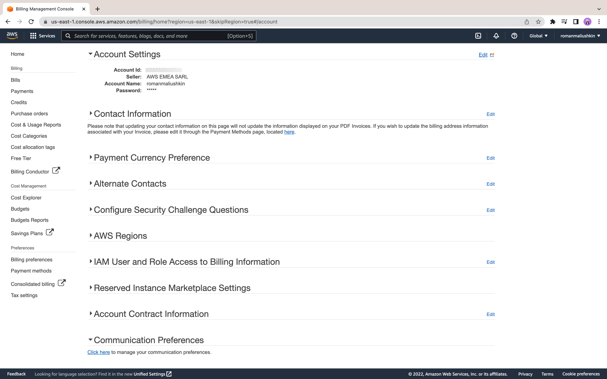
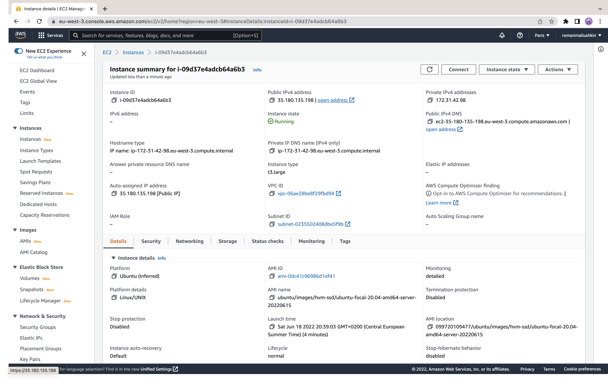

# Практическое задание по теме «Облачные провайдеры и синтаксис Terraform»

## Задача 1 (вариант с AWS). Регистрация в aws и знакомство с основами (необязательно, но крайне желательно).

Остальные задания можно будет выполнять и без этого аккаунта, но с ним можно будет увидеть полный цикл процессов. 

AWS предоставляет достаточно много бесплатных ресурсов в первый год после регистрации, подробно описано [здесь](https://aws.amazon.com/free/).
1. Создайте аккаут aws.
1. Установите c aws-cli https://aws.amazon.com/cli/.
1. Выполните первичную настройку aws-sli https://docs.aws.amazon.com/cli/latest/userguide/cli-configure-quickstart.html.
1. Создайте IAM политику для терраформа c правами
    * AmazonEC2FullAccess
    * AmazonS3FullAccess
    * AmazonDynamoDBFullAccess
    * AmazonRDSFullAccess
    * CloudWatchFullAccess
    * IAMFullAccess
1. Добавьте переменные окружения 
    ```
    export AWS_ACCESS_KEY_ID=(your access key id)
    export AWS_SECRET_ACCESS_KEY=(your secret access key)
    ```
1. Создайте, остановите и удалите ec2 инстанс (любой с пометкой `free tier`) через веб интерфейс. 

В виде результата задания приложите вывод команды `aws configure list`.

### Ход работы

1. Создадим новый аккаунт на AWS:



2. Установим AWS CLI по [ссылке](https://awscli.amazonaws.com/AWSCLIV2.pkg). Проверим версию:

```shell
aws --version
aws-cli/2.7.9 Python/3.9.11 Darwin/21.5.0 exe/x86_64 prompt/off
```

3. Выполним первичную настройку AWS CLI:

   * Добавим нового пользователя в сервисе IAM:
   

   
   * Введём команду `aws configure` и заполним поля:

```shell
aws configure
AWS Access Key ID [None]: <key_1>
AWS Secret Access Key [None]: <key_2>
Default region name [None]: eu-west-3
Default output format [None]: yaml
```

4. К созданному пользователю добавим права из списка 
   
   * AmazonEC2FullAccess
   * AmazonS3FullAccess
   * AmazonDynamoDBFullAccess
   * AmazonRDSFullAccess
   * CloudWatchFullAccess
   * IAMFullAccess

Результат работы:

```shell
aws configure list                                                   
      Name                    Value             Type    Location
      ----                    -----             ----    --------
   profile                <not set>             None    None
access_key     ****************5XGL              env    
secret_key     ****************dfns              env    
    region                eu-west-3      config-file    ~/.aws/config
```

## Задача 2. Создание aws ec2 или yandex_compute_instance через терраформ. 

1. В каталоге `terraform` вашего основного репозитория, который был создан в начале курсе, создайте файл `main.tf` и `versions.tf`.
2. Зарегистрируйте провайдер 
   1. для [aws](https://registry.terraform.io/providers/hashicorp/aws/latest/docs). В файл `main.tf` добавьте
   блок `provider`, а в `versions.tf` блок `terraform` с вложенным блоком `required_providers`. Укажите любой выбранный вами регион 
   внутри блока `provider`.
   2. либо для [yandex.cloud](https://registry.terraform.io/providers/yandex-cloud/yandex/latest/docs). Подробную инструкцию можно найти 
   [здесь](https://cloud.yandex.ru/docs/solutions/infrastructure-management/terraform-quickstart).
3. Внимание! В гит репозиторий нельзя пушить ваши личные ключи доступа к аккаунту. Поэтому в предыдущем задании мы указывали
их в виде переменных окружения. 
4. В файле `main.tf` воспользуйтесь блоком `data "aws_ami` для поиска ami образа последнего Ubuntu.  
5. В файле `main.tf` создайте рессурс 
   1. либо [ec2 instance](https://registry.terraform.io/providers/hashicorp/aws/latest/docs/resources/instance).
   Постарайтесь указать как можно больше параметров для его определения. Минимальный набор параметров указан в первом блоке 
   `Example Usage`, но желательно, указать большее количество параметров.
   2. либо [yandex_compute_image](https://registry.terraform.io/providers/yandex-cloud/yandex/latest/docs/resources/compute_image).
6. Также в случае использования aws:
   1. Добавьте data-блоки `aws_caller_identity` и `aws_region`.
   2. В файл `outputs.tf` поместить блоки `output` с данными об используемых в данный момент: 
       * AWS account ID,
       * AWS user ID,
       * AWS регион, который используется в данный момент, 
       * Приватный IP ec2 инстансы,
       * Идентификатор подсети в которой создан инстанс.  
7. Если вы выполнили первый пункт, то добейтесь того, что бы команда `terraform plan` выполнялась без ошибок. 

В качестве результата задания предоставьте:
1. Ответ на вопрос: при помощи какого инструмента (из разобранных на прошлом занятии) можно создать свой образ ami?
1. Ссылку на репозиторий с исходной конфигурацией терраформа.  

### Ход работы

1. Для сборки собственного образа AMI можно использовать [Packer](https://learn.hashicorp.com/tutorials/packer/aws-get-started-build-image?in=packer/aws-get-started).

2. [Ссылка](terraform) на конфигурацию Terraform. Для демонстрации выполненного задания покажем результат основных команд:

   * Выполним команду `terraform plan`:

```shell
...
Plan: 1 to add, 0 to change, 0 to destroy.

Changes to Outputs:
  + account_id          = "903098511831"
  + caller_user         = "AIDA5ERG5WHLWRTUDAP2H"
  + current_aws_region  = "eu-west-3"
  + instance_private_ip = (known after apply)
  + instance_subnet_id  = (known after apply)
```

  * Выполним команду `terraform  apply -auto-approve`:

```shell
...
Apply complete! Resources: 1 added, 0 changed, 0 destroyed.

Outputs:

account_id = "903098511831"
caller_user = "AIDA5ERG5WHLWRTUDAP2H"
current_aws_region = "eu-west-3"
instance_private_ip = "172.31.42.98"
instance_subnet_id = "subnet-0235502408dbe5f9b"
```

  * Результат в AWS:




