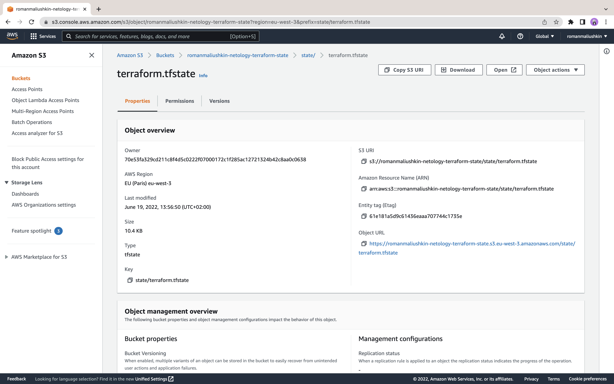
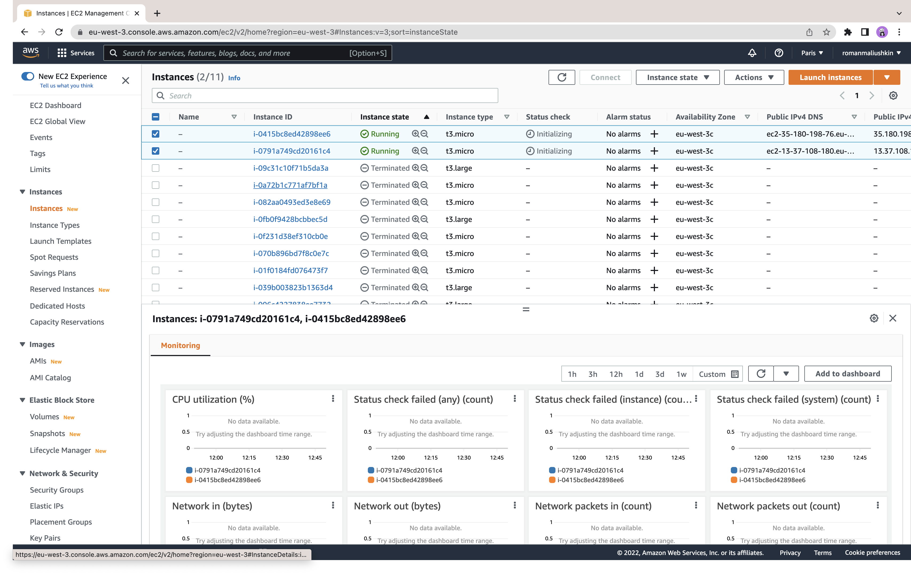

# Практическое задание по теме «Основы Terraform»

## Задача 1. Создадим бэкэнд в S3 (необязательно, но крайне желательно).

Если в рамках предыдущего задания у вас уже есть аккаунт AWS, то давайте продолжим знакомство со взаимодействием
терраформа и aws. 

1. Создайте s3 бакет, iam роль и пользователя от которого будет работать терраформ. Можно создать отдельного пользователя,
а можно использовать созданного в рамках предыдущего задания, просто добавьте ему необходимы права, как описано 
[здесь](https://www.terraform.io/docs/backends/types/s3.html).
1. Зарегистрируйте бэкэнд в терраформ проекте как описано по ссылке выше. 

### Ход работы

1. Добавим S3-бакет с помощью ресурсов `aws_s3_bucket` и `aws_dynamodb_table` в конфигурации Terraform:

```terraform
resource "aws_s3_bucket" "terraform_state" {
  bucket = "romanmaliushkin-netology-terraform-state"

  versioning {
    enabled = true
  }
}

resource "aws_dynamodb_table" "terraform_locks" {
  name         = "terraform-lock"
  billing_mode = "PAY_PER_REQUEST"
  hash_key     = "LockID"

  attribute {
    name = "LockID"
    type = "S"
  }
}
```

2. Добавим backend `s3`:

```terraform
terraform {
  backend "s3" {
    bucket         = "romanmaliushkin-netology-terraform-state"
    key            = "state/terraform.tfstate"
    region         = "eu-west-3"
    dynamodb_table = "terraform-lock"
    encrypt        = true
  }
}
```

## Задача 2. Инициализируем проект и создаем воркспейсы. 

1. Выполните `terraform init`:
    * если был создан бэкэнд в S3, то терраформ создат файл стейтов в S3 и запись в таблице 
dynamodb.
    * иначе будет создан локальный файл со стейтами.  
1. Создайте два воркспейса `stage` и `prod`.
1. В уже созданный `aws_instance` добавьте зависимость типа инстанса от вокспейса, что бы в разных ворскспейсах 
использовались разные `instance_type`.
1. Добавим `count`. Для `stage` должен создаться один экземпляр `ec2`, а для `prod` два. 
1. Создайте рядом еще один `aws_instance`, но теперь определите их количество при помощи `for_each`, а не `count`.
1. Что бы при изменении типа инстанса не возникло ситуации, когда не будет ни одного инстанса добавьте параметр
жизненного цикла `create_before_destroy = true` в один из рессурсов `aws_instance`.
1. При желании поэкспериментируйте с другими параметрами и рессурсами.

В виде результата работы пришлите:
* Вывод команды `terraform workspace list`.
* Вывод команды `terraform plan` для воркспейса `prod`.

### Ход работы

1. Запустим `terraform init`, проверим S3:



Был добавлен файл состояния `s3://romanmaliushkin-netology-terraform-state/state/terraform.tfstate`.

2. Добавим воркспейсы:

```shell
terraform workspace new stage
Created and switched to workspace "stage"!

You're now on a new, empty workspace. Workspaces isolate their state,
so if you run "terraform plan" Terraform will not see any existing state
for this configuration.

terraform workspace new prod 
Created and switched to workspace "prod"!

You're now on a new, empty workspace. Workspaces isolate their state,
so if you run "terraform plan" Terraform will not see any existing state
for this configuration.
```

3. Внесём изменения в [main.tf](terraform/main.tf), а так же добавим [locals.tf](terraform/locals.tf) согласно заданию.

4. Развернём инфраструктуру, например `stage`. Проверим в AWS:

```shell
terraform workspace stage
terraform workspace list        
  default
  prod
* stage
terraform plan
terraform apply
...
```

Вывод команды `terraform plan` в [логах](terraform/tf-log). Проверим AWS (должно быть 2 инстанса типа `t3.micro`):


