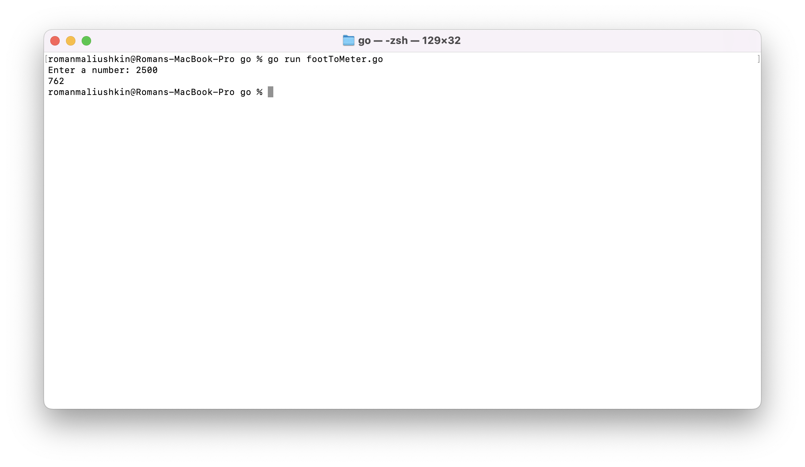
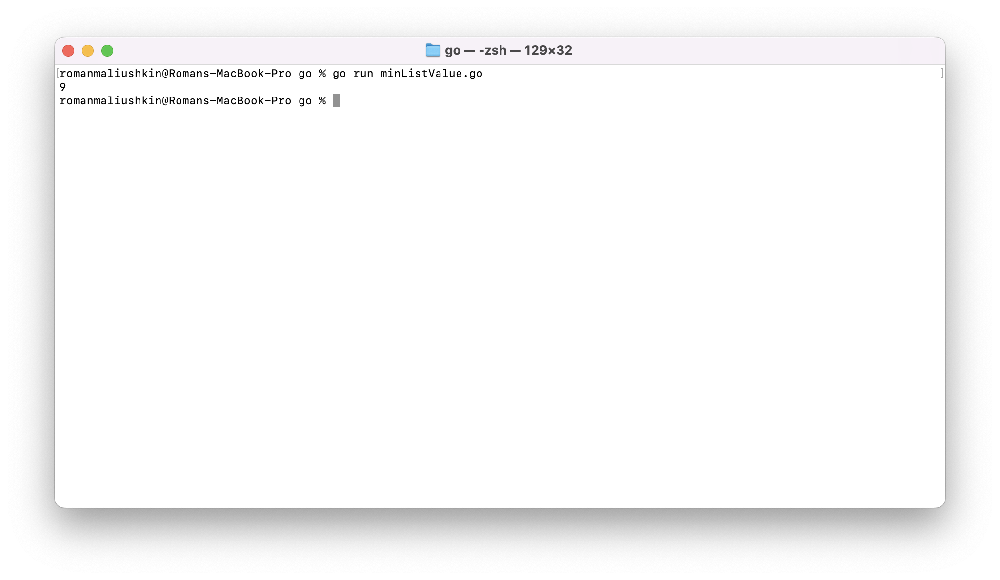
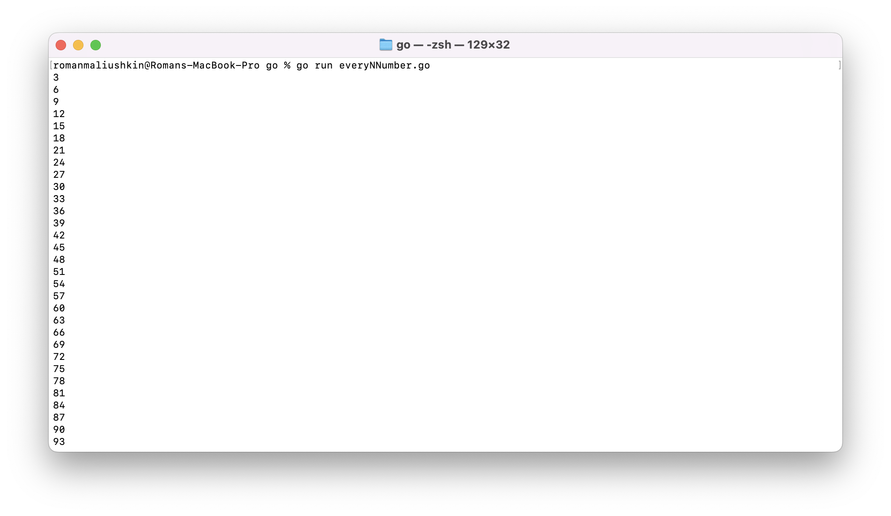

# Практическое задание по теме «Введение в Golang»

## Задача 1. Установите golang.

1. Воспользуйтесь инструкций с официального сайта: [https://golang.org/](https://golang.org/).
2. Так же для тестирования кода можно использовать песочницу: [https://play.golang.org/](https://play.golang.org/).

### Ход работы

Скачаем и установим Go по [ссылке](https://go.dev/dl/go1.18.3.darwin-amd64.pkg). Проверим версию:

```shell
code version  
code version go1.18.3 darwin/amd64
```


## Задача 3. Написание кода. 
Цель этого задания закрепить знания о базовом синтаксисе языка. Можно использовать редактор кода 
на своем компьютере, либо использовать песочницу: [https://play.golang.org/](https://play.golang.org/).

1. Напишите программу для перевода метров в футы (1 фут = 0.3048 метр). Можно запросить исходные данные 
у пользователя, а можно статически задать в коде.
    Для взаимодействия с пользователем можно использовать функцию `Scanf`:
    ```
    package main
    
    import "fmt"
    
    func main() {
        fmt.Print("Enter a number: ")
        var input float64
        fmt.Scanf("%f", &input)
    
        output := input * 2
    
        fmt.Println(output)    
    }
    ```
 
1. Напишите программу, которая найдет наименьший элемент в любом заданном списке, например:
    ```
    x := []int{48,96,86,68,57,82,63,70,37,34,83,27,19,97,9,17,}
    ```
1. Напишите программу, которая выводит числа от 1 до 100, которые делятся на 3. То есть `(3, 6, 9, …)`.

В виде решения ссылку на код или сам код. 

### Ход работы

Для выполнения работ была использована IDE GoLand 2022.1.2

1. Код доступен по [ссылке](code/footToMeter.go). Результат выполнения программы:



2. Код доступен по [ссылке](code/footToMeter.go). Результат выполнения программы:



3. Код доступен по [ссылке](code/everyNNumber.go). Результат выполнения программы:



## Задача 4. Протестировать код (не обязательно).

Создайте тесты для функций из предыдущего задания. 

### Ход работы

1. Код доступен по [ссылке](code/footToMeter_test.go).
2. Код доступен по [ссылке](code/minListValue_test.go). 