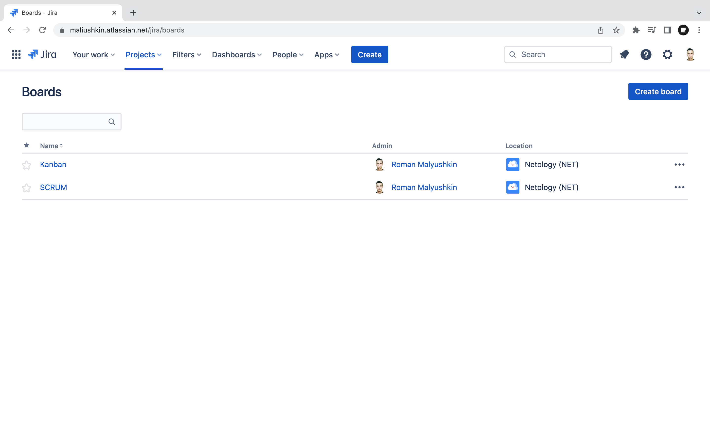
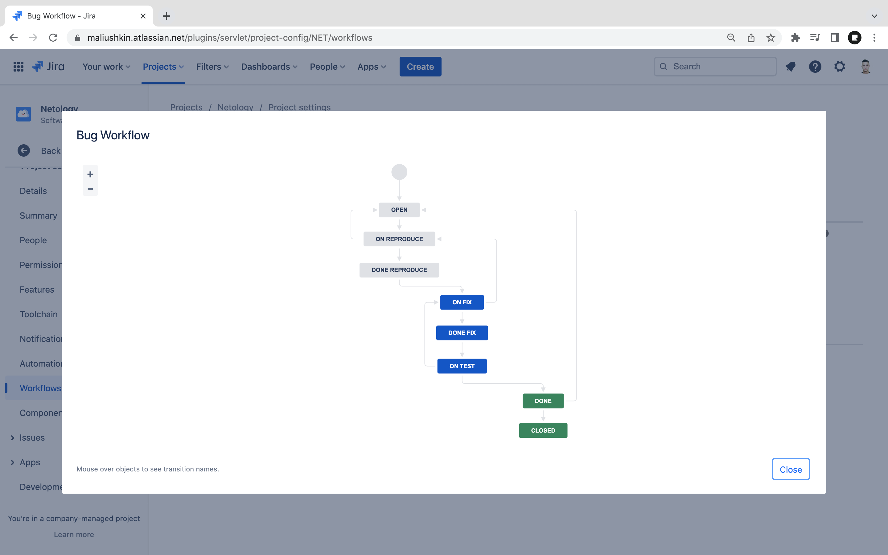
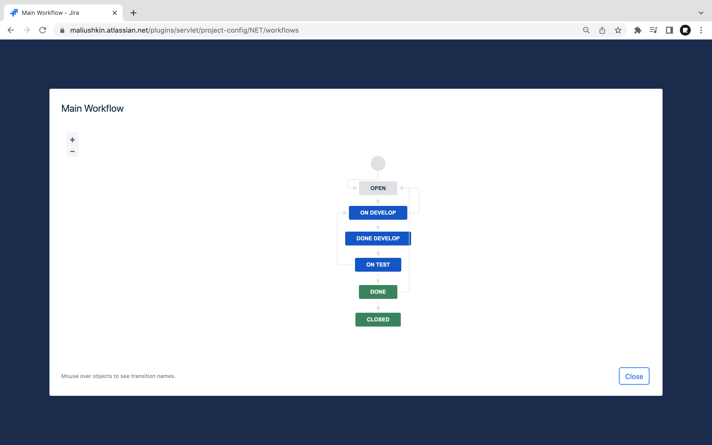
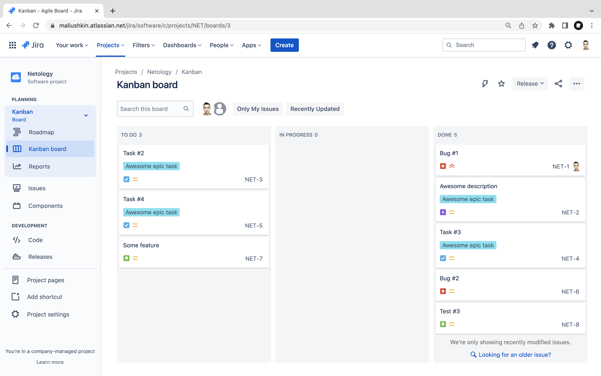
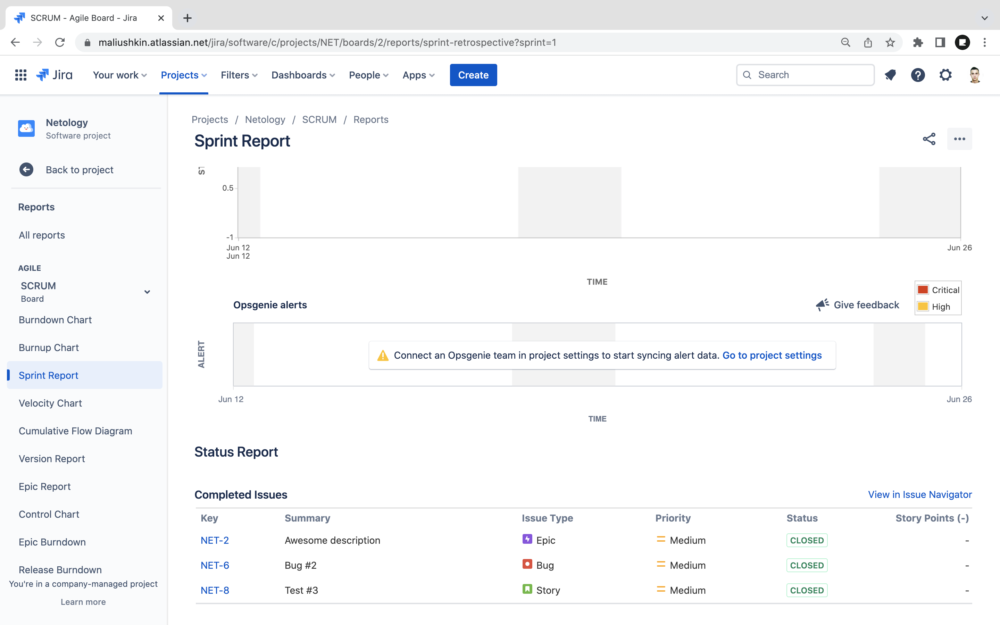

# Практическое задание по теме «Жизненный цикл ПО»

## Подготовка к выполнению

1. Получить бесплатную [JIRA](https://www.atlassian.com/ru/software/jira/free)
2. Создать доски kanban и scrum

### Ход работы

Авторизируемся на сайте [Atlassian.com](https://www.atlassian.com) под своей учётной записью. Получим [бесплатную версию]((https://www.atlassian.com/ru/software/jira/free)) Jira. 

Создадим проект Netology, добавим две доски: SCRUM и Kanban:

[Ссылка](https://maliushkin.atlassian.net/jira/boards) на Jira.

## Основная часть

В рамках основной части необходимо создать собственные workflow для двух типов задач: bug и остальные типы задач. Задачи типа bug должны проходить следующий жизненный цикл:
1. Open -> On reproduce
2. On reproduce <-> Open, Done reproduce
3. Done reproduce -> On fix
4. On fix <-> On reproduce, Done fix
5. Done fix -> On test
6. On test <-> On fix, Done
7. Done <-> Closed, Open

Остальные задачи должны проходить по упрощённому workflow:
1. Open -> On develop
2. On develop <-> Open, Done develop
3. Done develop -> On test
4. On test <-> On develop, Done
5. Done <-> Closed, Open

Создать задачу с типом bug, попытаться провести его по всему workflow до Done. Создать задачу с типом epic, к ней привязать несколько задач с типом task, провести их по всему workflow до Done. При проведении обеих задач по статусам использовать kanban. Вернуть задачи в статус Open.
Перейти в scrum, запланировать новый спринт, состоящий из задач эпика и одного бага, стартовать спринт, провести задачи до состояния Closed. Закрыть спринт.

### Ход работы

1. Workflow для задач типа bug:

2. Workflow для остальных задач:

3. Kanban-доска:

4. Отчёт спринта (SCRUM):

Приложим XML-файлы созданных workflow: [Bug Workflow](xml/Bug%20Workflow.xml), [Main Workflow](xml/Main%20Workflow.xml).
