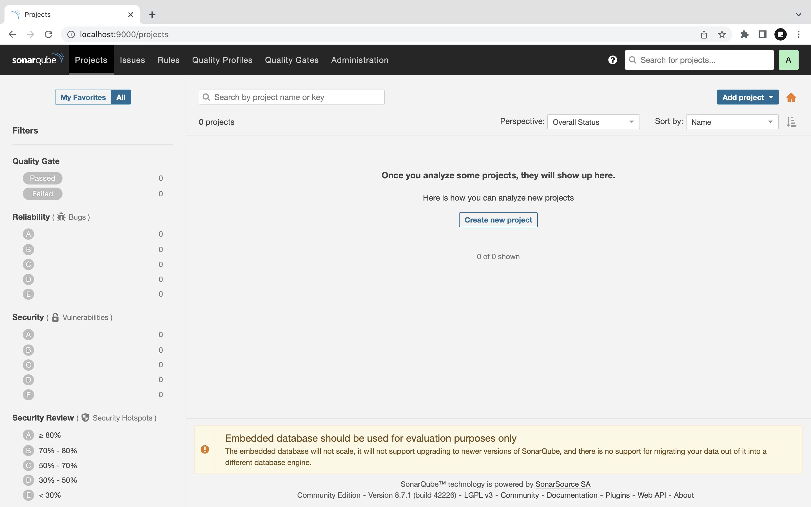
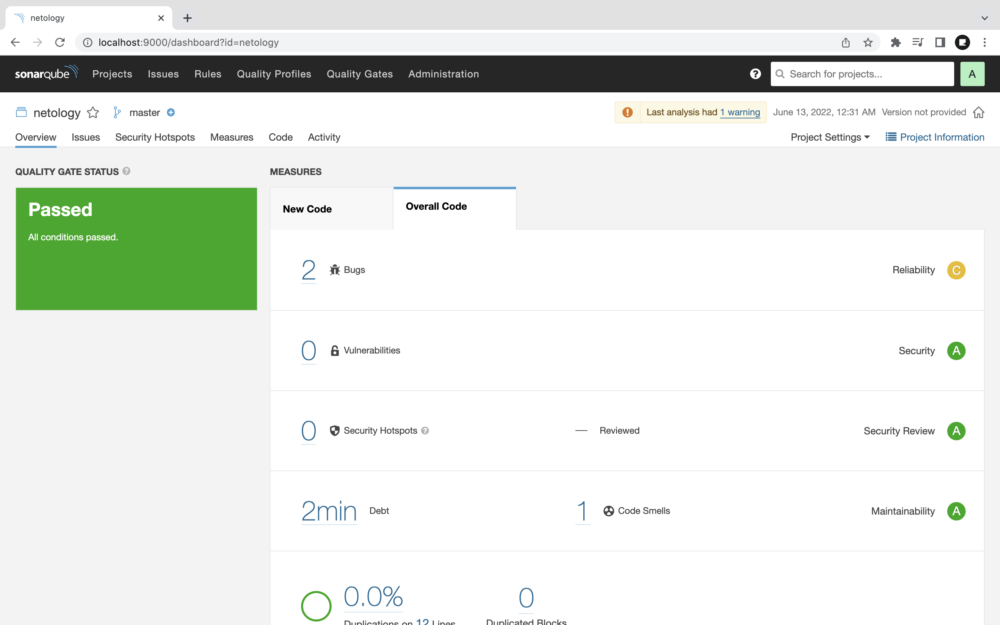
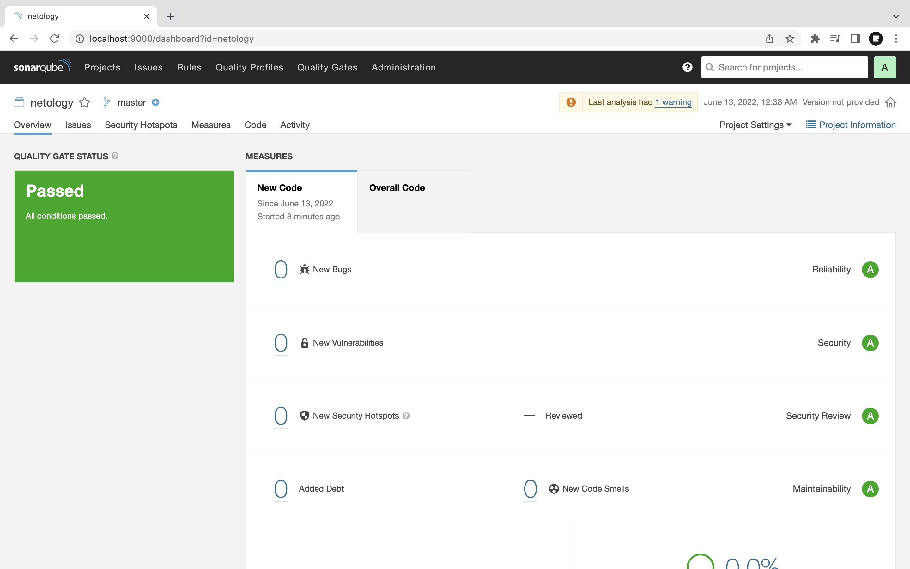
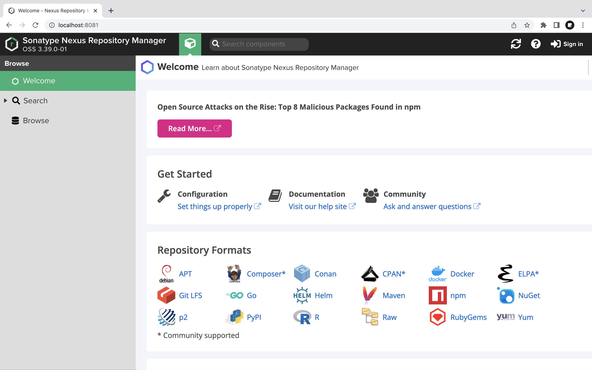
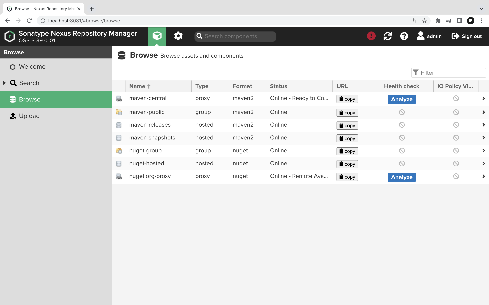
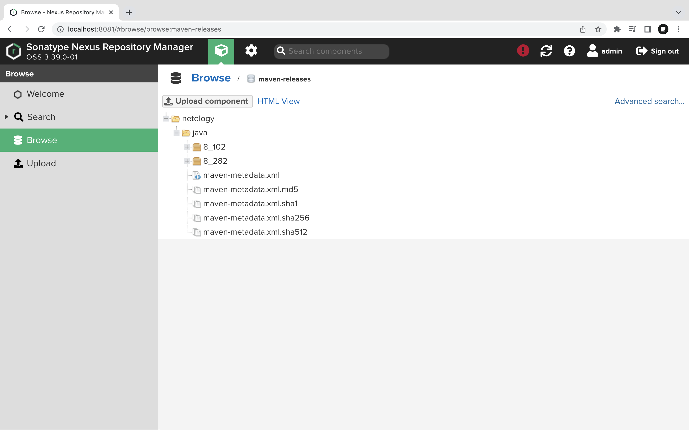
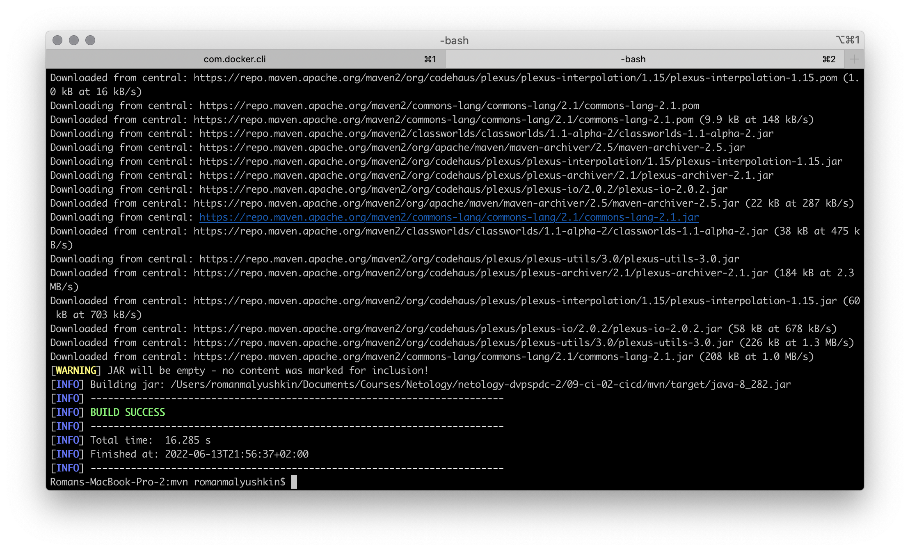

# Практическое задание по теме «Процессы CI/CD»

## Знакомоство с SonarQube

### Подготовка к выполнению

1. Выполняем `docker pull sonarqube:8.7-community`
2. Выполняем `docker run -d --name sonarqube -e SONAR_ES_BOOTSTRAP_CHECKS_DISABLE=true -p 9000:9000 sonarqube:8.7-community`
3. Ждём запуск, смотрим логи через `docker logs -f sonarqube`
4. Проверяем готовность сервиса через [браузер](http://localhost:9000)
5. Заходим под admin\admin, меняем пароль на свой

#### Ход работы

Проделаем шаги из списка выше и получим результат:

cp ~/Downloads/sonar-scanner-4.7.0.2747-macosx/bin/sonar-scanner /usr/local/bin/



### Основная часть

1. Создаём новый проект, название произвольное
2. Скачиваем пакет sonar-scanner, который нам предлагает скачать сам sonarqube
3. Делаем так, чтобы binary был доступен через вызов в shell (или меняем переменную PATH или любой другой удобный вам способ)
4. Проверяем `sonar-scanner --version`
5. Запускаем анализатор против кода из директории [example](./example) с дополнительным ключом `-Dsonar.coverage.exclusions=fail.py`
6. Смотрим результат в интерфейсе
7. Исправляем ошибки, которые он выявил(включая warnings)
8. Запускаем анализатор повторно - проверяем, что QG пройдены успешно
9. Делаем скриншот успешного прохождения анализа, прикладываем к решению ДЗ

#### Ход работы

1. Создаём проект под названием `netology`.
2. Скачиваем [SonarScanner](https://binaries.sonarsource.com/Distribution/sonar-scanner-cli/sonar-scanner-cli-4.7.0.2747-macosx.zip).
3. Добавим бинарный файл в переменную `PATH`:

```shell
export PATH=/Users/romanmalyushkin/Downloads/sonar-scanner-4.7.0.2747-macosx/bin/:$PATH
```

4. Проверяем `sonar-scanner --version`:

```shell
sonar-scanner --version
INFO: Scanner configuration file: /Users/romanmalyushkin/Downloads/sonar-scanner-4.7.0.2747-macosx/conf/sonar-scanner.properties
INFO: Project root configuration file: NONE
INFO: SonarScanner 4.7.0.2747
INFO: Java 11.0.14.1 Eclipse Adoptium (64-bit)
INFO: Mac OS X 10.15.7 x86_64
```

5. Запускаем анализатор для файла [fail.py](example/fail.py):

```shell
sonar-scanner \
  -Dsonar.projectKey=netology \
  -Dsonar.sources=. \
  -Dsonar.host.url=http://localhost:9000 \
  -Dsonar.login=5ff098a32e0e9dd00f5b79afba5af2091f2c4f20  \
  -Dsonar.coverage.exclusions=fail.py
```

6. Смотрим результат в интерфейсе:



7. Исправляем ошибки, запускаем анализатор и проверяем результат в интерфейсе:



## Знакомство с Nexus

### Подготовка к выполнению

1. Выполняем `docker pull sonatype/nexus3`
2. Выполняем `docker run -d -p 8081:8081 --name nexus sonatype/nexus3`
3. Ждём запуск, смотрим логи через `docker logs -f nexus`
4. Проверяем готовность сервиса через [бразуер](http://localhost:8081)
5. Узнаём пароль от admin через `docker exec -it nexus /bin/bash`
6. Подключаемся под админом, меняем пароль, сохраняем анонимный доступ

#### Ход работы

Проделаем шаги из списка выше и получим результат:



Для получения пароля введём команду:

```shell
cat /nexus-data/admin.password
524f7975-64dd-4e49-b3c1-b5f0f8c37851
```

Затем, авторизируемся в интерфейсе Nexus:



### Основная часть

1. В репозиторий `maven-public` загружаем артефакт с GAV параметрами:
   1. groupId: netology
   2. artifactId: java
   3. version: 8_282
   4. classifier: distrib
   5. type: tar.gz
2. В него же загружаем такой же артефакт, но с version: 8_102
3. Проверяем, что все файлы загрузились успешно
4. В ответе присылаем файл `maven-metadata.xml` для этого артефекта

#### Ход работы

Создаём файлы. В результате получаем директорию:



Так же можно ознакомиться с [XML-файлом](nexus/maven-metadata.xml).

### Знакомство с Maven

### Подготовка к выполнению

1. Скачиваем дистрибутив с [maven](https://maven.apache.org/download.cgi)
2. Разархивируем, делаем так, чтобы binary был доступен через вызов в shell (или меняем переменную PATH или любой другой удобный вам способ)
3. Проверяем `mvn --version`
4. Забираем директорию [mvn](./mvn) с pom

#### Ход работы

1. Скачиваем дистрибутив по [ссылке](https://dlcdn.apache.org/maven/maven-3/3.8.6/binaries/apache-maven-3.8.6-bin.tar.gz). 
2. Распаковываем и прописывает путь в `$PATH`:

```shell
export PATH=/Users/romanmalyushkin/Downloads/apache-maven-3.8.6/bin/:$PATH
```

3. Проверяем `mvn --version`:

```shell
mvn --version
Apache Maven 3.8.6 (84538c9988a25aec085021c365c560670ad80f63)
Maven home: /Users/romanmalyushkin/Downloads/apache-maven-3.8.6
Java version: 1.8.0_191, vendor: Oracle Corporation, runtime: /Library/Java/JavaVirtualMachines/jdk1.8.0_191.jdk/Contents/Home/jre
Default locale: en_RU, platform encoding: UTF-8
OS name: "mac os x", version: "10.15.7", arch: "x86_64", family: "mac"
```

### Основная часть

1. Меняем в `pom.xml` блок с зависимостями под наш артефакт из первого пункта задания для Nexus (java с версией 8_282)
2. Запускаем команду `mvn package` в директории с `pom.xml`, ожидаем успешного окончания
3. Проверяем директорию `~/.m2/repository/`, находим наш артефакт
4. В ответе присылаем исправленный файл `pom.xml`

#### Ход работы

1. После редактирования файла [pom.xml](mvn/pom.xml) запускаем `mvn package`:



Исправленный [XML-файл](mvn/pom.xml).
