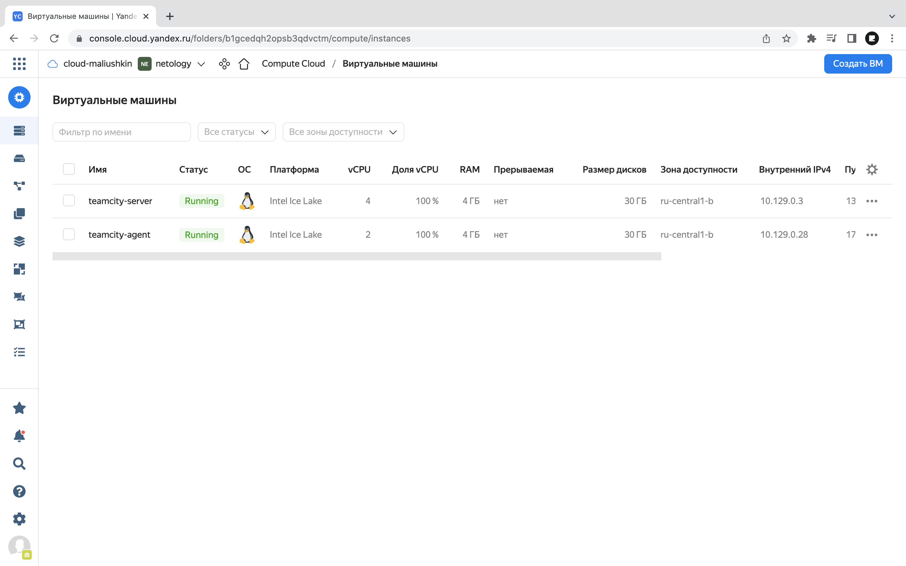
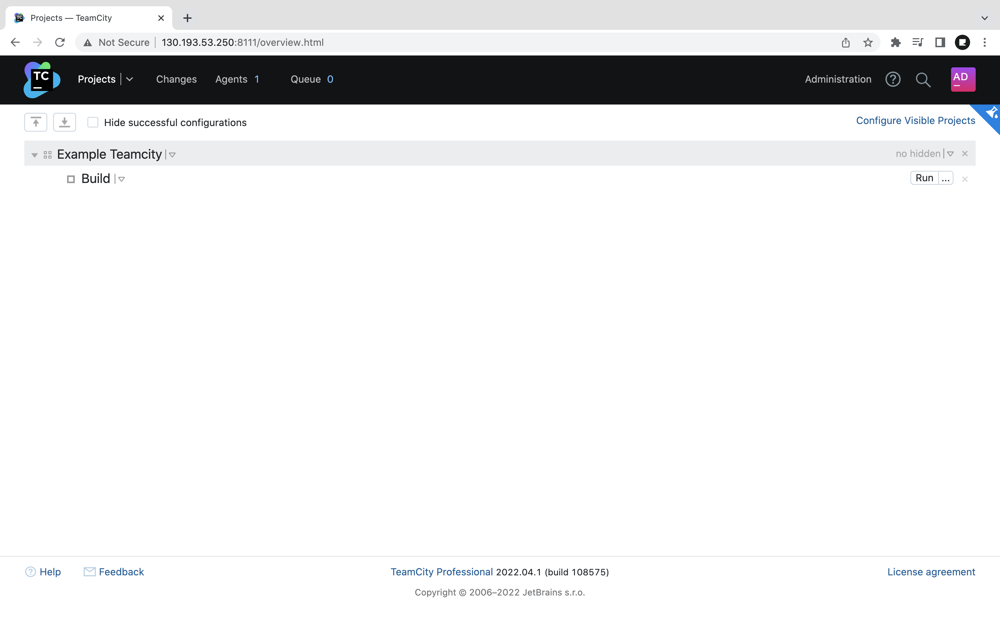
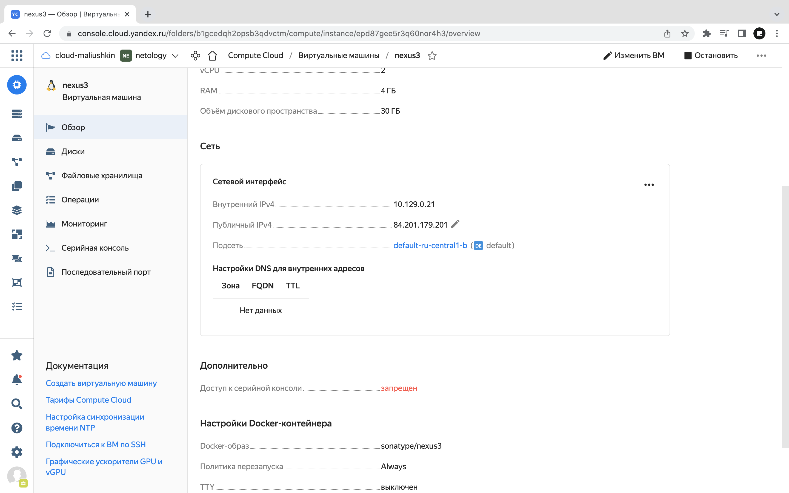
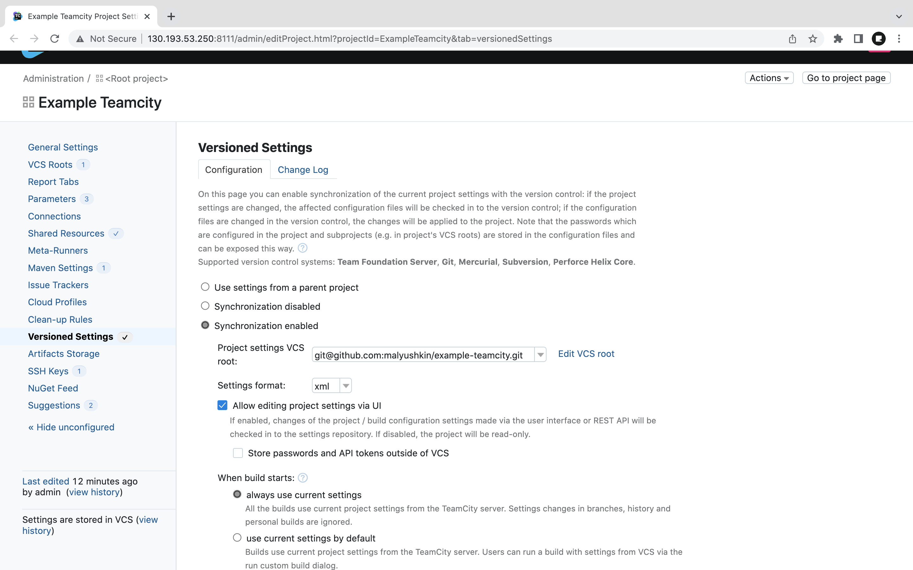

# Практическое задание по теме «TeamCity»

## Подготовка к выполнению

1. Поднимите инфраструктуру [teamcity](./teamcity/docker-compose.yml)
2. Если хочется, можете создать свою собственную инфраструктуру на основе той технологии, которая нравится. Инструкция по установке из [документации](https://www.jetbrains.com/help/teamcity/installing-and-configuring-the-teamcity-server.html)
3. Дождитесь запуска teamcity, выполните первоначальную настройку
4. Авторизуйте агент
5. Сделайте fork [репозитория](https://github.com/aragastmatb/example-teamcity)

### Ход работы

1. Развернём 2 ВМ (`jetbrains/teamcity-server`, `jetbrains/teamcity-agent`) в Yandex Cloud:



2. Запустим Teamcity (server), авторизуем агент и сделаем fork [репозитория](https://github.com/aragastmatb/example-teamcity): [malyushkin/example-teamcity](https://github.com/malyushkin/example-teamcity).

## Основная часть

1. Создайте новый проект в teamcity на основе fork
2. Сделайте autodetect конфигурации
3. Сохраните необходимые шаги, запустите первую сборку master'a
4. Поменяйте условия сборки: если сборка по ветке `master`, то должен происходит `mvn clean package`, иначе `mvn clean test`
5. Мигрируйте `build configuration` в репозиторий
6. Создайте отдельную ветку `feature/add_reply` в репозитории
7. Напишите новый метод для класса Welcomer: метод должен возвращать произвольную реплику, содержащую слово `hunter`
8. Дополните тест для нового метода на поиск слова `hunter` в новой реплике
9. Сделайте push всех изменений в новую ветку в репозиторий
10. Убедитесь что сборка самостоятельно запустилась, тесты прошли успешно
11. Внесите изменения из произвольной ветки `feature/add_reply` в `master` через `Merge`
12. Убедитесь, что нет собранного артефакта в сборке по ветке `master`
13. Настройте конфигурацию так, чтобы она собирала `.jar` в артефакты сборки
14. Проведите повторную сборку мастера, убедитесь, что сбора прошла успешно и артефакты собраны
15. Проверьте, что конфигурация в репозитории содержит все настройки конфигурации из teamcity
16. В ответ предоставьте ссылку на репозиторий

### Ход работы

1. Проект в teamcity на основе fork:



2. Так как адрес из [репозитория](https://github.com/aragastmatb/example-teamcity) не доступен, развернём свою ВМ с Nexus:
   1. **Docker**: sonatype/nexus3;
   2. **vCPU**: 2, **RAM**: 4 ГБ.
   


3. Далее, заходим в созданную ВМ и узнаём пароль от Nexus, авторизируемся в Nexsus. 

```
roman@nexus3:~$ docker exec -it 9062893b978a cat /nexus-data/admin.password; echo
27221048-ba67-49f6-ad2c-d5f1e4a6b0fc
```

**Пароль меняем на `admin123`**! (из-за настроек файла `settings.xml`):

```xml
...
<server>
    <id>nexus</id>
    <username>admin</username>
    <password>admin123</password>
</server>
...
```

На странице администрирования Nexus копируем адрес и вставляем его на место нерабочего ([тут](https://github.com/malyushkin/example-teamcity/edit/master/pom.xml)):

`http://51.250.34.239:8081/repository/maven-releases/` → `http://84.201.179.201:8081/repository/maven-releases/`

После этого можно запускаем сборку.

4. Изменяем условия сборки и мигрируем в репозиторий:



5. Добавим ветку [`feature/add_reply`](https://github.com/malyushkin/example-teamcity/tree/feature/add_reply).
