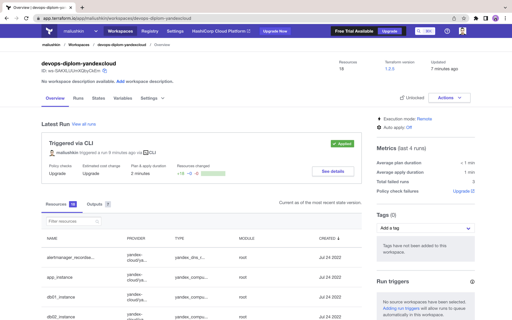
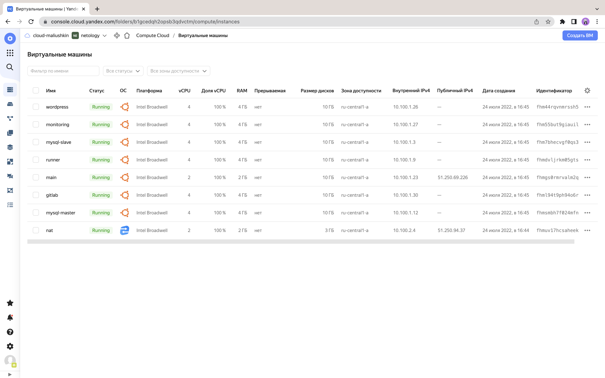
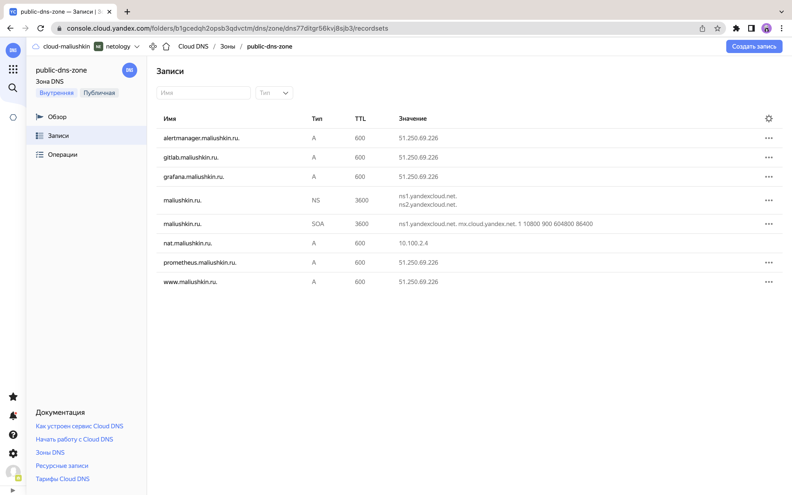

# Дипломный практикум в YandexCloud

## Подготовка к работе

1. Создадим авторский домен `maliushkin.ru` на [reg.ru](https://www.reg.ru/). Пропишем DNS-серверы (`ns1.yandexcloud.net`, `ns2.yandexcloud.net`).


2. Создадим новый workspace `devops-diplom-yandexcloud` в Terraform Cloud.


## Terraform

Подготовим инфраструктуру в Yandex Cloud при помощи Terraform. Файлы конфигурации доступны по [ссылке](terraform). 

**Краткое описание** 

* В `provider.tf` добавим конфигурацию провайдера `yandex`:

```terraform
terraform {
  required_providers {
    yandex = {
      source  = "yandex-cloud/yandex"
      version = "0.75.0"
    }
  }
}

provider "yandex" {
  token     = var.YANDEX_TOKEN
  cloud_id  = var.yandex_cloud_id
  folder_id = var.yandex_folder_id
  zone      = "ru-central1-a"
}
```

* В `variables.tf` добавим Яндекс токен и идентефикаторы облака:

```terraform
variable "YANDEX_TOKEN" {}

variable "yandex_folder_id" {
  default = "b1gcedqh2opsb3qdvctm"
}

variable "yandex_cloud_id" {
  default = "b1grvrc5vladcufpdjjn"
}

variable "SSH_ID_RSA_PUB" {}
```

* В `main.tf` добавим конфигурацию backend:

```terraform
terraform {
  cloud {
    organization = "maliushkin"

    workspaces {
      name = "devops-diplom-yandexcloud"
    }
  }
}
```

* В `main.tf` добавим настройки всех инстансов. Пример, настройки для сервера `app.maliushkin.domain`:

```terraform
resource "yandex_compute_instance" "app_instance" {
  name = "wordpress"
  zone = "ru-central1-a"

  resources {
    cores  = 4
    memory = 4
  }

  boot_disk {
    initialize_params {
      image_id = "fd81d2d9ifd50gmvc03g"
      size     = 10
    }
  }

  network_interface {
    subnet_id = yandex_vpc_subnet.private_vpc_subnet.id
  }

  metadata = {
    ssh-keys = "ubuntu:${file("~/.ssh/id_rsa.pub")}"
  }
}
```

* В `nextwork.tf` добавим сетевые настройки.
* В `output.tf` добавим вывод настроек доступа и IP-адресов.

### Запуск Terraform

1. Выполним `terraform init`:

```shell
terraform init


Initializing Terraform Cloud...

Initializing provider plugins...
- Finding yandex-cloud/yandex versions matching "0.75.0"...
- Installing yandex-cloud/yandex v0.75.0...
- Installed yandex-cloud/yandex v0.75.0 (self-signed, key ID E40F590B50BB8E40)

...

Terraform Cloud has been successfully initialized!

You may now begin working with Terraform Cloud. Try running "terraform plan" to
see any changes that are required for your infrastructure.

If you ever set or change modules or Terraform Settings, run "terraform init"
again to reinitialize your working directory.
```

2. Выполним `terraform validate`:

```shell
terraform validate

Success! The configuration is valid.
```

3. В Terraform Cloud добавим переменные окружения: 
* `TF_VAR_YANDEX_TOKEN` — по [инструкции](https://cloud.yandex.com/en/docs/iam/concepts/authorization/oauth-token).
* `TF_VAR_SSH_ID_RSA_PUB` — копируем из `cat ~/.ssh/id_rsa.pub`.

Выполним `terraform plan`:

```shell
terraform apply --auto-approve

...
Plan: 18 to add, 0 to change, 0 to destroy.

Changes to Outputs:
  + app_maliushkin_ru_ip_addr_internal        = (known after apply)
  + db01_maliushkin_ru_ip_addr_internal       = (known after apply)
  + db02_maliushkin_ru_ip_addr_internal       = (known after apply)
  + gitlab_maliushkin_ru_ip_addr_internal     = (known after apply)
  + host_maliushkin_ru_ip_addr_external       = (known after apply)
  + monitoring_maliushkin_ru_ip_addr_internal = (known after apply)
  + ssh_config                                = (known after apply)
```

4. Выполним `terraform apply --auto-approve`. 

```shell
terraform apply --auto-approve

...
Apply complete! Resources: 18 added, 0 changed, 0 destroyed.
...
```

После создания инфраструктуры проверим Terraform Cloud:




Так же проверим UI Yandex Cloud:

* **Виртуальные машины**



* **Зона DNS**



Инфраструктура **успешно** развёрнута. 

## Ansible

Подготовим сценарии Ansible для созданной инфраструктуры. Файлы конфигурации доступны по [ссылке](ansible). 

**Краткое описание** 

* 

Для работы Ansible необходимо добавить IP-адреса:

1. config
2. ansible
3. prometheus

