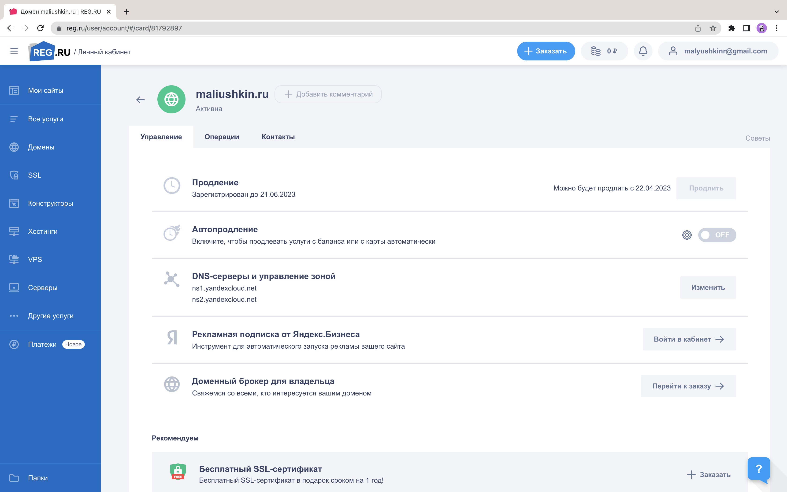
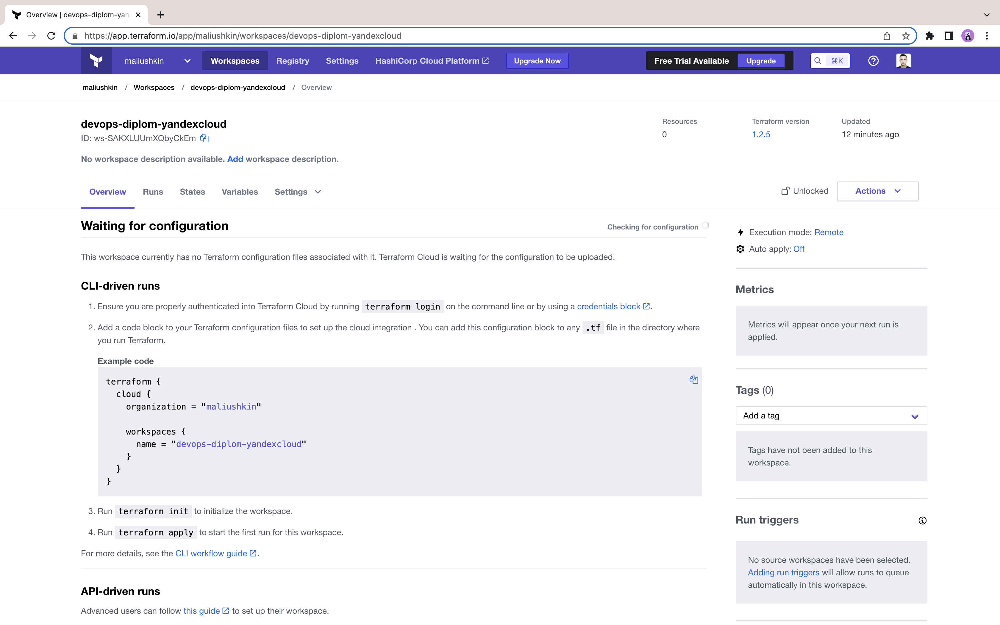

# Дипломный практикум в YandexCloud

## Подготовка к работе

1. Создадим авторский домен `maliushkin.ru` на [reg.ru](https://www.reg.ru/).

2. Создадим новый workspace `devops-diplom-yandexcloud` в Terraform Cloud.

## Terraform

## Ansible

